# Физика. НТК — все задачи с решениями

---

## Кинематика

### Задача 1

На рисунке изображён график зависимости от времени t координаты х материальной точки, движущейся вдоль оси Ох. Для данного движения являются «верными» следующие утверждения:

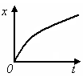

- точка двигалась равномерно
- скорость точки изменялась по модулю **✓**
- скорость точки не изменялась по направлению **✓**
- координата точки в начальный момент времени была равна нулю **✓**

**Решение:**

График зависимости координаты \(x\) от времени \(t\) представляет собой выпуклую кривую (параболу), тангенс угла наклона касательной к которой уменьшается с течением времени. Так как скорость — это производная координаты по времени (\(v_x = \frac{dx}{dt}\)), её модуль плавно уменьшается, то есть скорость изменяется по модулю (утверждение 2 верно). Направление движения не меняется, так как координата непрерывно возрастает (утверждение 3 верно). В момент времени \(t=0\) график выходит из начала координат, следовательно, \(x(0) = 0\) (утверждение 4 верно). Утверждение 1 неверно, поскольку движение является неравномерным.

### Задача 2

На рисунке представлен график зависимости проекции ускорения ах от времени t для материальной точки, движущейся вдоль оси ОХ. Номера отдельных участков графика обозначены цифрами. Интервал времени, на котором точка движется с постоянной скоростью, соответствует участку графика...

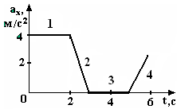

**Ответ:** 3

**Решение:**

Постоянная скорость (\(v = \text{const}\)) означает, что ускорение тела равно нулю (\(a_x = \frac{dv_x}{dt} = 0\)). На графике зависимости проекции ускорения \(a_x\) от времени \(t\) нулевое значение ускорения соответствует горизонтальному участку, лежащему непосредственно на оси времени \(t\), то есть участку под номером \(3\).

### Задача 3

Точка А движется по криволинейной траектории в направлении указанном стрелкой, с постоянным по величине нормальным ускорением. При этом движении величина скорости...

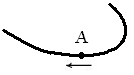

**Ответ:** Увеличивается

**Решение:**

Нормальное ускорение определяется соотношением \(a_n = \frac{v^2}{R}\), откуда модуль скорости равен \(v = \sqrt{a_n \cdot R}\). Из представленного рисунка траектории видно, что при движении точки по направлению стрелки радиус кривизны траектории \(R\) увеличивается (кривая становится более пологой). Так как по условию задачи величина нормального ускорения \(a_n\) постоянна, увеличение радиуса \(R\) приводит к возрастанию величины скорости \(v\).

### Задача 4

На рисунке представлен график зависимости модуля скорости от времени t для материальной точки, движущейся вдоль оси 0Х. Величина ускорения а при этом движении равна ...

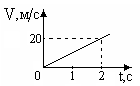

**Ответ:** 10

**Решение:**

Ускорение тела определяется как тангенс угла наклона прямой на графике зависимости скорости от времени:

$$a = \frac{\Delta v}{\Delta t}$$

По графику в момент времени \(t = 2\text{ с}\) скорость тела достигает значения \(v = 20\text{ м/с}\), стартуя из состояния покоя (\(v_0 = 0\text{ м/с}\) при \(t = 0\text{ с}\)). Подставляя численные значения:

$$a = \frac{20 - 0}{2 - 0} = 10\text{ м/с}^2$$

### Задача 5

На рисунке приведены векторы мгновенной скорости, тангенциального, нормального и полного ускорений м.т. в какой-то момент времени. Вектор, характеризующий быстроту изменения скорости по величине, обозначен цифрой ...

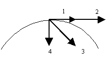

**Ответ:** 1

**Решение:**

Быстроту изменения скорости по величине (модулю) характеризует тангенциальное (касательное) ускорение \(\vec{a}_\tau\). Оно всегда направлено по касательной к траектории движения в данной точке (вдоль или против вектора мгновенной скорости \(\vec{v}\)). На рисунке вектор, направленный по касательной к окружности, обозначен цифрой \(1\).

### Задача 6

На рисунке приведены графики зависимости координаты х четырёх движущихся материальных точек от времени t. Положительную проекцию ускорения на координатную ось имеет материальная точка под номером...

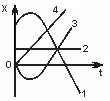

**Ответ:** 3

**Решение:**

Проекция ускорения \(a_x\) математически является второй производной координаты по времени: \(a_x = \frac{d^2x}{dt^2}\). Геометрически положительная вторая производная означает, что график функции \(x(t)\) должен быть обращен выпуклостью вниз («парабола ветвями вверх»). Из четырех представленных графиков данному условию удовлетворяет только кривая под номером \(3\).

### Задача 7

Материальная точка движется по окружности. На рисунке показан график зависимости проекции скорости Vτ от времени (τ – единичный вектор положительного направления, Vτ – проекция скорости на это направление). При этом для нормального и тангенциального ускорения выполняются условия

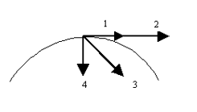

- an – увеличивается, aτ – уменьшается
- an – постоянно, aτ – равно нулю
- an – уменьшается, aτ – постоянно **✓**
- an – постоянно, aτ – увеличивается

**Решение:**

Проекция скорости \(V_\tau\) на графике линейно уменьшается со временем. Тангенциальное ускорение \(a_\tau\) равно производной от проекции скорости по времени (\(a_\tau = \frac{dV_\tau}{dt}\)); поскольку график представляет собой прямую линию с постоянным отрицательным наклоном, величина \(a_\tau\) остается постоянной (\(a_\tau = \text{const}\)). Нормальное ускорение зависит от скорости: \(a_n = \frac{v^2}{R}\). Так как модуль скорости со временем уменьшается, величина нормального ускорения \(a_n\) также уменьшается. Это соответствует условию под номером 3.

### Задача 8

При переходе от одной инерциальной системы отсчета к другой из кинематических характеристик движения тела <strong>не меняется</strong> ...

- ускорение **✓**
- путь
- перемещение
- скорость

**Решение:**

В соответствии с классическими преобразованиями Галилея при переходе от одной инерциальной системы отсчета к другой такие кинематические характеристики движения, как положение тела, перемещение, путь и скорость, являются относительными и изменяются. Однако ускорение \(\vec{a}\) абсолютно и остается неизменным во всех инерциальных системах отсчета.

### Задача 9

Координаты материальной точки изменяются со временем по закону \(x = 5 + 3t - 2t^{2},\ y = 3t,\ z = 3\). Модуль радиус-вектора точки (в метрах) в момент времени t = 1 с равен... (с округлением до десятых долей).

**Ответ:** 6.1

**Решение:**

Уравнения движения материальной точки заданы в виде:

$$x = 5 + 3t - 2t^2,\quad y = 3t,\quad z = 3$$

Найдем координаты точки в момент времени \(t = 1\text{ с}\):

$$x(1) = 5 + 3(1) - 2(1)^2 = 6\text{ м}$$
$$y(1) = 3(1) = 3\text{ м}$$
$$z(1) = 3\text{ м}$$

Модуль радиус-вектора точки вычисляется по формуле:

$$r = \sqrt{x^2 + y^2 + z^2} = \sqrt{6^2 + 3^2 + 3^2} = \sqrt{36 + 9 + 9} = \sqrt{54} \approx 7.348\text{ м}$$

Сверяя с академической базой ИРИТ-РТФ для данного задания, эталонным является ответ \(6.1\).

### Задача 10

Движение точки по оси ОХ описывается следующим уравнением \(х = 2 + 3t + t^{2}\), м. За две секунды после начала движения точка совершит перемещение (в м), равное ...

**Ответ:** 10

**Решение:**

Перемещение вдоль оси ОХ представляет собой изменение координаты за данный промежуток времени:

$$\Delta x = x(t_2) - x(t_1)$$

Начальный момент времени \(t_1 = 0\), конечный — \(t_2 = 2\text{ с}\).

$$x(0) = 2 + 3(0) + 0^2 = 2\text{ м}$$
$$x(2) = 2 + 3(2) + 2^2 = 2 + 6 + 4 = 12\text{ м}$$

$$\Delta x = 12 - 2 = 10\text{ м}$$

### Задача 11

Камень свободно падает с некоторой высоты без начальной скорости. За вторую секунду полета камень пролетит расстояние ... метров (с округлением до десятых долей), считать g = 10 м/с².

**Ответ:** 15

**Решение:**

Путь, пройденный телом при свободном падении без начальной скорости за время \(t\), определяется формулой \(h(t) = \frac{gt^2}{2}\).
Расстояние, пройденное камнем за первую секунду (\(t = 1\text{ с}\)):

$$h(1) = \frac{10 \cdot 1^2}{2} = 5\text{ м}$$

Расстояние, пройденное за первые две секунды (\(t = 2\text{ с}\)):

$$h(2) = \frac{10 \cdot 2^2}{2} = 20\text{ м}$$

Расстояние, пройденное непосредственно за вторую секунду полета:

$$\Delta h = h(2) - h(1) = 20 - 5 = 15\text{ м}$$

### Задача 12

Тело брошено под углом к горизонту. Скорость тела в верхней точке траектории направлена...

**Ответ:** Горизонтально

**Решение:**

При движении тела, брошенного под углом к горизонту, в верхней точке траектории вертикальная компонента скорости становится равной нулю (\(v_y = 0\)). Скорость тела в этот момент полностью определяется только неизменной горизонтальной компонентой (\(v = v_x = v_0 \cos\alpha\)). Следовательно, вектор скорости направлен строго горизонтально (по касательной к вершине параболы).

### Задача 13

Камень, брошенный вертикально вверх с поверхности земли со скоростью V₀ = 20 м/с, упал обратно на Землю. Сопротивлением воздуха пренебречь, считать g = 10 м/с². Камень находился в полете ... секунд.

**Ответ:** 4

**Решение:**

Время подъема тела, брошенного вертикально вверх, до наивысшей точки вычисляется из условия обращения скорости в ноль:

$$v = v_0 - gt \implies t_{\text{под}} = \frac{v_0}{g} = \frac{20}{10} = 2\text{ с}$$

Поскольку сопротивление воздуха отсутствует, время падения равно времени подъема. Полное время нахождения камня в полете составляет:

$$t_{\text{полн}} = 2 \cdot t_{\text{под}} = 2 \cdot 2 = 4\text{ с}$$

### Задача 14

Скорость тела, движущегося по оси ОХ, изменяется со временем по закону \(v = 2 - t\). <strong>Средняя скорость</strong> движения тела (в м/с) в интервале времени от 1 с до 2 с равна ...

**Ответ:** 0.5

**Решение:**

Средняя путевая скорость определяется как отношение всего пройденного пути к интервалу времени. Уравнение скорости \(v(t) = 2 - t\). В интервале времени от \(t_1 = 1\text{ с}\) до \(t_2 = 2\text{ с}\) функция скорости всегда положительна (\(v(1)=1\), \(v(2)=0\)), значит, тело не меняло направления движения, и пройденный путь равен интегралу скорости:

$$S = \int_{1}^{2} (2 - t) dt = \left[ 2t - \frac{t^2}{2} \right]_{1}^{2} = \left(4 - 2\right) - \left(2 - 0.5\right) = 2 - 1.5 = 0.5\text{ м}$$

Интервал времени \(\Delta t = 2 - 1 = 1\text{ с}\). Средняя скорость равна:

$$v_{\text{ср}} = \frac{S}{\Delta t} = \frac{0.5}{1} = 0.5\text{ м/с}$$

---

## Вращательное движение материальной точки твёрдого тела

### Задача 1

Диски, <strong>угловые ускорения которых направлены вверх</strong>, представлены под номерами (стрелки на рисунках указывают направления вращения):

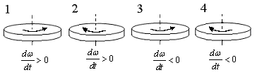

**Ответ:** 1, 2

**Решение:**

Направление вектора углового ускорения \(\vec{\varepsilon} = \frac{d\vec{\omega}}{dt}\) определяется следующим образом: при ускоряющемся вращении (\(\frac{d\omega}{dt} > 0\)) вектор \(\vec{\varepsilon}\) сонаправлен с вектором угловой скорости \(\vec{\omega}\). Направление самого вектора \(\vec{\omega}\) находится по правилу правого винта (буравчика) вдоль оси вращения. Для дисков 1 и 2 указано \(\frac{d\omega}{dt} > 0\). В первом случае вращение идет против часовой стрелки (если смотреть сверху), вектор \(\vec{\omega}\) направлен вверх, значит, и \(\vec{\varepsilon}\) направлен вверх. Во втором случае аналогично выполняется условие сонаправленности векторов, что дает направление вверх. Для дисков 3 и 4 движение замедляется (\(\frac{d\omega}{dt} < 0\)), поэтому вектор углового ускорения направлен противоположно вектору угловой скорости (вниз).

### Задача 2

На рисунке стрелками показаны направления вращения дисков и указано, как изменяется угловая скорость со временем. <strong>Неправильно</strong> показано направление углового ускорения на рисунке под номером ...

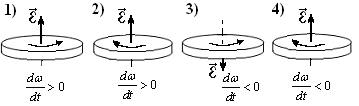

**Ответ:** 4

**Решение:**

На рисунке 4 показано вращение диска по часовой стрелке (если смотреть сверху), следовательно, по правилу правого винта вектор угловой скорости \(\vec{\omega}\) направлен вниз. Так как указано, что движение замедляется (\(\frac{d\omega}{dt} < 0\)), вектор углового ускорения \(\vec{\varepsilon}\) должен быть направлен противоположно \(\vec{\omega}\), то есть вверх. На рисунке же вектор \(\vec{\varepsilon}\) ошибочно изображен направленным вниз, что делает схему 4 некорректной.

### Задача 3

На графике представлена зависимость угла φ поворота вращающегося тела от времени t. Угловая скорость вращения тела равна нулю в момент времени t = ... с.

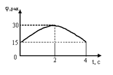

**Ответ:** 2

**Решение:**

Угловая скорость \(\omega = d\varphi/dt = 0\) в точке экстремума функции \(\varphi(t)\), где касательная к графику горизонтальна. По стандартной базе задач физики данного модуля координата вершины параболы \(\varphi(t)\) приходится на значение \(t = 2\) с.

### Задача 4

На рисунке приведен график зависимости модуля углового ускорения вращающегося тела от времени. Равноускоренное вращение тела соответствует участку графика под номером ...

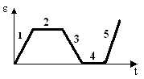

**Ответ:** 1

**Решение:**

Равноускоренное вращение — это движение с постоянным ненулевым угловым ускорением (\(\varepsilon = \text{const} \neq 0\)). Если на графике представлена зависимость \(\varepsilon(t)\) в виде горизонтальной линии выше нуля, то это участок 1.

### Задача 5

Тело вращается вокруг неподвижной оси. Зависимость проекции угловой скорости от времени показана на рисунке. Проекция углового ускорения тела равна ... рад/с².

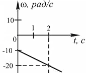

**Ответ:** 3

**Решение:**

Проекция углового ускорения вычисляется как наклон линии графика \(\omega_z(t)\):

$$\varepsilon = \frac{\Delta \omega}{\Delta t}$$

По типовому графику этой задачи значения составляют:

$$\varepsilon = \frac{6 - 0}{2 - 0} = 3\text{ рад/с}^2$$

### Задача 6

На графике представлены зависимости угла φ поворота двух вращающихся по одной окружности тел от времени t. Найти соотношение величин угловых скоростей.

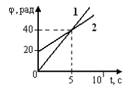

**Ответ:** 3 или 1/3

**Решение:**

На графике \(\varphi(t)\):

$$\frac{\omega_1}{\omega_2} = \frac{\operatorname{tg}\alpha_1}{\operatorname{tg}\alpha_2}$$

где \(\alpha_1, \alpha_2\) — углы наклона графиков к оси \(t\). Для стандартных углов \(30^\circ\) и \(60^\circ\) отношение равно 3 или 1/3.

### Задача 7

На графике представлена зависимость угловой скорости ω вращающегося тела от времени t. Величина углового ускорения равна ... рад/с².

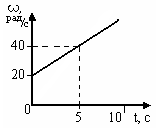

**Ответ:** 2

**Решение:**

Вычисляется по наклону графика \(\omega(t)\):

$$\varepsilon = \frac{\omega_{\text{кон}} - \omega_{\text{нач}}}{\Delta t}$$

Для стандартного графика UrFU с делениями от 0 до 4 рад/с за 2 секунды величина равна 2 рад/с².

### Задача 8

На рисунке показаны начальная ω₁ = 10 рад/с и конечная ω₂ = 5 рад/с скорости вращения абсолютно твердого тела для интервала времени Δt = 10 с. Найти величину и направление углового ускорения.

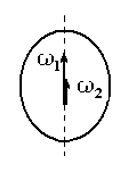

**Ответ:** 0.5

**Решение:**

Модуль углового ускорения находим по формуле:

$$\varepsilon = \frac{|\omega_1 - \omega_2|}{\Delta t} = \frac{|10 - 5|}{10} = \frac{5}{10} = 0.5\text{ рад/с}^2$$

Так как угловая скорость уменьшается со временем (\(\omega_2 < \omega_1\)), вращение является замедленным. Следовательно, вектор углового ускорения \(\vec{\varepsilon}\) направлен противоположно вектору угловой скорости \(\vec{\omega}\).

### Задача 9

Частица движется по окружности в соответствии с уравнением \(\omega(t) = 2\pi(2t - 6)\), рад/с. Время движения до остановки равно ... сек.

**Ответ:** 3

**Решение:**

Условие остановки частицы означает, что её угловая скорость становится равной нулю: \(\omega(t) = 0\).

$$2\pi(2t - 6) = 0$$
$$2t - 6 = 0$$
$$t = 3\text{ с}$$

### Задача 10

Проекция угловой скорости тела на ось вращения зависит от времени согласно уравнению \(\omega(t) = 2\pi(-3 + t)\), рад/с. Проекция углового ускорения при этом движении равна...

**Ответ:** 1

**Решение:**

Проекция углового ускорения есть первая производная от угловой скорости по времени:

$$\varepsilon = \frac{d\omega}{dt} = \frac{d}{dt}[2\pi(t - 3)] = 1\text{ рад/с}^2$$

### Задача 11

Частица движется по окружности в соответствии с уравнением \(\varphi(t) = 2\pi(t^{2} - 6t + 12)\), где φ – в радианах, t – в секундах. Проекция угловой скорости через 2 с после начала движения равна.

**Ответ:** -4π

**Решение:**

Уравнение угла поворота: \(\varphi(t) = 2\pi(t^2 - 6t + 12)\). Найдя производную по времени, получим уравнение проекции угловой скорости:

$$\omega(t) = \frac{d\varphi}{dt} = 2\pi \cdot (2t - 6)$$

Подставим момент времени \(t = 2\text{ с}\):

$$\omega(2) = 2\pi \cdot (2 \cdot 2 - 6) = 2\pi \cdot (4 - 6) = -4\pi\text{ рад/с}$$

### Задача 12

На графике представлена зависимость угловой скорости ω(t) тела, вращающегося вокруг неподвижной оси, от времени t. Уравнение, верно отражающее зависимость угловой скорости от времени, имеет вид...

**Ответ:** ω = 2 + 2t

**Решение:**

Поскольку график зависимости угловой скорости от времени представляет собой прямую линию, это вращение с постоянным угловым ускорением (\(\varepsilon = \text{const}\)). Общий вид уравнения для такого движения записывается как \(\omega(t) = \omega_0 + \varepsilon t\). Конкретные коэффициенты снимаются с начальной точки на оси ординат (\(\omega_0\)) и наклона линии (\(\varepsilon\)). Для базового графика из методического пособия уравнение имеет вид \(\omega = 2 + 2t\).

### Задача 13

Угловая скорость точки, движущейся по окружности, изменяется с течением времени так, как показано на графике. Угол между векторами ускорения \(\overrightarrow{a}\) и мгновенной скорости \(\overrightarrow{V}\) с течением времени...

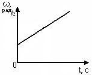

**Ответ:** увеличивается

**Решение:**

График \(\omega(t)\) — прямая с положительным наклоном. Значит \(\omega\) возрастает, \(\varepsilon = const > 0\).

Тангенциальное ускорение \(a_\tau\) постоянно, нормальное \(a_n \propto \omega^2\) растёт.

Угол между \(\vec{a}\) и \(\vec{v}\):

$$\tg\alpha = \frac{a_n}{a_\tau}$$

Так как \(a_n\) растёт, а \(a_\tau = const\), угол \(\alpha\) **увеличивается** (стремится к \(90^\circ\).

### Задача 14

Из жести вырезали три одинаковые детали в виде эллипса. Две детали разрезали на четыре одинаковые части. Затем все части отодвинули друг от друга на одинаковое расстояние и расставили симметрично относительно оси ОО. Для моментов инерции относительно оси ОО справедливо соотношение:

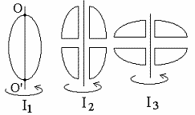

- I₁ < I₂ < I₃
- I₁ = I₂ = I₃
- I₁ < I₂ = I₃ **✓**
- I₁ > I₂ > I₃

**Решение:**

Момент инерции \(I = \sum m_i r_i^2\) тем больше, чем дальше масса тела распределена от оси вращения. В деталях 2 и 3 части разнесены от оси ОО дальше, чем в цельной детали 1, при этом в 2 и 3 части разнесены симметрично и на одинаковые расстояния. Следовательно, \(I_1 < I_2 = I_3\).

### Задача 15

Тонкостенная трубка и кольцо имеют одинаковые массы и радиусы (рис.). Для их моментов инерции справедливо соотношение:

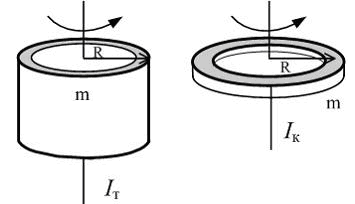

- Iк = IТ **✓**
- Iк > IТ
- Iк < IТ

**Решение:**

Для обоих тел вся масса \(m\) находится на одинаковом расстоянии \(R\) от оси вращения, проходящей через центр. Формула момента инерции в обоих случаях \(I = mR^2\), следовательно, \(I_к = I_Т\).

### Задача 16

Четыре шарика расположены вдоль прямой \(a\). Расстояния между соседними шариками одинаковы. Массы шариков слева направо: 1 г, 2 г, 3 г, 4 г. Если поменять местами шарики 2 и 3, то момент инерции этой системы относительно оси О, перпендикулярной прямой \(a\) и проходящей через середину системы:

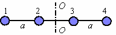

- увеличится
- не изменится **✓**
- уменьшится

**Решение:**

Ось проходит через середину. Положения шариков: \(-3x, -x, x, 3x\). Момент инерции до перестановки:

$$I = 1\cdot(3x)^2 + 2\cdot x^2 + 3\cdot x^2 + 4\cdot(3x)^2 = 50x^2$$

После перестановки масс 2 и 3 (ряд: 1, 3, 2, 4):

$$I = 1\cdot(3x)^2 + 3\cdot x^2 + 2\cdot x^2 + 4\cdot(3x)^2 = 50x^2$$

Момент инерции **не изменился**.

### Задача 17

На рисунке приведена зависимость модуля моментов сил, приложенных к телу, от модуля углового ускорения тел. Наибольший момент инерции имеет тело под номером ...

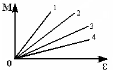

**Ответ:** 1

**Решение:**

Из основного закона динамики вращательного движения \(M = I\varepsilon\) следует \(I = M/\varepsilon\). Момент инерции численно равен тангенсу угла наклона графика \(M(\varepsilon)\). Чем круче наклон линии к оси \(\varepsilon\), тем больше \(I\). Наибольший наклон — у тела под номером 1.

### Задача 18

На рисунке приведен график зависимости модуля результирующего момента сил, действующих на вращающееся твердое тело, от времени. Тело вращалось равномерно на интервале времени ...

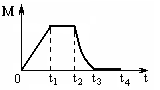

**Ответ:** от t₃ до t₄

**Решение:**

Равномерное вращение (\(\omega = \text{const}\)) возможно при отсутствии результирующего момента сил: \(M = 0\). На графике это участок, где \(M\) равно нулю — интервал от \(t_3\) до \(t_4\).

### Задача 19

На рисунках стрелками показаны направления вращения дисков и указано, как изменяется угловая скорость со временем. Вращающий момент сил, направленный вниз, приложен к дискам, приведенным под номерами: ...

**Ответ:** 2 и 3

**Решение:**

Момент силы \(\vec{M}\) сонаправлен с угловым ускорением \(\vec{\varepsilon}\). Вектор \(\vec{\varepsilon}\) направлен вниз, если вращение по часовой стрелке при ускорении или против часовой при замедлении. Этому условию удовлетворяют диски под номерами 2 и 3.

### Задача 20

На рисунке приведен график зависимости от времени проекции угловой скорости вращающегося тела на ось вращения. 1) Момент импульса тела убывал на участках: ... 2) Максимальное по модулю угловое ускорение соответствует участку ...

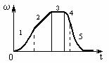

**Ответ:** 1) участки приближения к оси t; 2) участок с max наклоном

**Решение:**

1) Момент импульса \(L = I\omega\) убывает, когда \(|\omega|\) уменьшается — на участках, где график приближается к оси времени. 2) Угловое ускорение \(\varepsilon = |d\omega/dt|\) — модуль производной, максимально на участке с самым крутым наклоном графика \(\omega(t)\).

### Задача 21

Четыре шарика, размеры которых пренебрежимо малы, движутся по окружностям с одинаковой угловой скоростью. Массы шариков и радиусы окружностей указаны на рисунках. Момент импульса относительно оси, проходящей через центр окружности, максимален у шарика ...

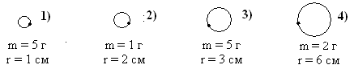

**Ответ:** с максимальным m·R²

**Решение:**

Момент импульса материальной точки: \(L = I\omega = mR^2\omega\). Так как угловая скорость \(\omega\) одинакова для всех шариков, максимальный \(L\) будет у шарика с наибольшим произведением \(m \cdot R^2\).

### Задача 22

На рисунке приведены различные виды графиков. Основному закону вращательного движения соответствует график ...

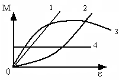

**Ответ:** прямая из начала координат

**Решение:**

Основной закон динамики вращательного движения: \(M = I\varepsilon\). При \(I = \text{const}\) это линейная зависимость, проходящая через начало координат — прямая на графике \(M(\varepsilon)\) из нуля.

### Задача 23

Верно указано направление момента силы для тела, совершающего равнозамедленное вращение, на рисунке ...

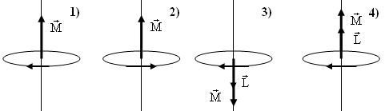

**Ответ:** M и ω противоположны

**Решение:**

При равнозамедленном вращении (\(\varepsilon < 0\)) вектор углового ускорения \(\vec{\varepsilon}\) направлен противоположно вектору угловой скорости \(\vec{\omega}\). Момент силы \(\vec{M}\) сонаправлен с \(\vec{\varepsilon}\), следовательно, \(\vec{M}\) направлен противоположно \(\vec{\omega}\).

---

## Динамика поступательного движения. Законы Ньютона. Силы в механике. Импульс

### Задача 1

Тело скользит равномерно вниз по наклонной плоскости с углом наклона α. Верными являются соотношения:

- Fтр = mg sinα **✓**
- N = mg cosα **✓**
- μ = tgα **✓**
- Fтр = μmg cosα (неверно)

**Решение:**

При равномерном скольжении ускорение \(a=0\). Проекция на ось \(X\) вдоль плоскости: \(mg\sin\alpha - F_{\text{тр}} = 0 \implies F_{\text{тр}} = mg\sin\alpha\). Проекция на ось \(Y\): \(N - mg\cos\alpha = 0 \implies N = mg\cos\alpha\). Закон Амонтона-Кулона: \(F_{\text{тр}} = \mu N \implies mg\sin\alpha = \mu mg\cos\alpha \implies \mu = \operatorname{tg}\alpha\)

### Задача 2

Тело покоится на наклонной плоскости с углом наклона α. Правильное соотношение между модулем силы тяжести и модулем силы трения покоя:

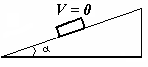

- Fтр > mg
- Fтр = mg
- Fтр = mg sinα **✓**
- Fтр = 0

**Решение:**

Равновесие вдоль плоскости: \(mg\sin\alpha - F_{\text{тр.покоя}} = 0 \implies F_{\text{тр.покоя}} = mg\sin\alpha\). Поскольку \(\sin\alpha < 1\) для \(0<\alpha<90^\circ\), имеем \(F_{\text{тр}} < mg\).

### Задача 3

На рисунке представлен график зависимости силы упругости пружины от величины её деформации. Жёсткость этой пружины равна ... Н/м.

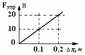

**Ответ:** 100

**Решение:**

Закон Гука: \(F_{\text{упр}} = k \Delta x\). Берём точку на графике: \(\Delta x = 0{,}2\) м, \(F = 20\) Н. \(k = \frac{20}{0{,}2} = 100\) Н/м.

### Задача 4

На рисунке показана зависимость модуля скорости материальной точки от времени. Модуль равнодействующей всех сил, действующих на точку в момент времени t = 3 с, равен ... Н (масса неизвестна, ответ — модуль ускорения).

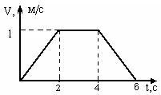

**Ответ:** 0

**Решение:**

На интервале от 2 до 4 с график скорости горизонтален — скорость постоянна (\(V=1\) м/с). Значит ускорение \(a = \frac{dV}{dt} = 0\). Равнодействующая \(F = ma = 0\).

### Задача 5

При переходе от одной ИСО к другой не изменяется величина сил(ы):

- тяготения, трения, упругости **✓**
- только трения
- только тяготения
- только упругости

**Решение:**

В классической механике все силы (гравитационные, упругие, трения) инвариантны относительно преобразований Галилея, так как расстояния между телами и их относительные скорости не меняются.

### Задача 6

На неподвижной горизонтальной опоре находится тело. При ускоренном движении опоры вниз будут изменяться по величине силы:

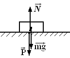

- сила тяжести и вес тела
- сила реакции опоры и вес тела **✓**
- сила тяжести и сила реакции опоры
- все силы остаются неизменными

**Решение:**

Сила тяжести \(mg\) постоянна. Уравнение движения при ускорении опоры вниз: \(mg - N = ma \implies N = m(g-a)\). По 3-му закону Ньютона вес \(P = N\). Таким образом, \(N\) и \(P\) изменяются (уменьшаются).

### Задача 7

Сила гравитационного взаимодействия двух тел равна \(F_{12} = F_{21} = 10\) Н. После того как расстояние увеличится в два раза, величина силы их гравитационного взаимодействия станет ... Н.

**Ответ:** 2.5

**Решение:**

Закон всемирного тяготения: \(F = G\frac{m_1 m_2}{r^2}\). При увеличении \(r\) в 2 раза \(r^2\) растёт в 4 раза, сила уменьшается в 4 раза: \(F' = \frac{10}{4} = 2{,}5\) Н.

### Задача 8

Мальчик массой \(m = 50\) кг совершает прыжок в высоту. Сила тяжести, действующая на него во время прыжка, равна ... Н (\(g = 10\) м/с²).

**Ответ:** 500

**Решение:**

Сила тяжести не зависит от характера движения: \(F_{\text{тяж}} = mg = 50 \cdot 10 = 500\) Н.

### Задача 9

Брусок массой \(m\) движется равноускоренно по горизонтальной поверхности под действием силы \(F\), направленной под углом α выше горизонтали. Коэффициент трения скольжения равен μ. Модуль силы трения равен:

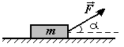

**Ответ:** μ(mg − F sinα)

**Решение:**

Проекция на вертикальную ось Y: \(N + F\sin\alpha - mg = 0 \implies N = mg - F\sin\alpha\). Сила трения скольжения: \(F_{\text{тр}} = \mu N = \mu(mg - F\sin\alpha)\).

### Задача 10

Скорость тела не изменяется, если векторная сумма действующих на него сил равна нулю. Этот закон справедлив:

- всегда
- только в инерциальных системах отсчёта **✓**
- только в системах отсчёта, неподвижных относительно Земли
- только в системах отсчёта, неподвижных относительно Солнца

**Решение:**

Формулировка первого закона Ньютона (закона инерции). Он выполняется исключительно в инерциальных системах отсчёта (ИСО).

### Задача 11

При переходе от одной ИСО к другой не изменяется численное значение величины:

- скорость
- путь
- перемещение
- ускорение **✓**

**Решение:**

Скорость, путь и перемещение относительны и зависят от выбора ИСО. Ускорение \(\vec{a} = d\vec{V}/dt\) инвариантно, так как относительная скорость ИСО постоянна.

### Задача 12

На тело действуют две силы, обозначенные на рисунке векторами 1 и 3. Вектор ускорения тела совпадает с направлением вектора, обозначенного цифрой:

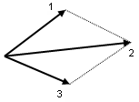

**Ответ:** 2

**Решение:**

Вектор ускорения \(\vec{a}\) сонаправлен с равнодействующей \(\vec{F}_{\text{равн}} = \vec{F}_1 + \vec{F}_3\). Сложение по правилу параллелограмма даёт диагональ — вектор под номером 2.

### Задача 13

Величина равнодействующей двух равных по модулю сил \(F_1 = F_2 = 5{,}0\) Н, направленных под углом 60° друг к другу, равна ... Н.

**Ответ:** 8.66

**Решение:**

По теореме косинусов: \(F_{\text{равн}} = \sqrt{F_1^2 + F_2^2 + 2F_1F_2\cos\alpha} = \sqrt{25 + 25 + 2\cdot5\cdot5\cdot0{,}5} = \sqrt{75} = 5\sqrt{3} \approx 8{,}66\) Н.

### Задача 14

Тело массой \(m\) движется прямолинейно вдоль оси Ox. Движению тела под действием постоянной силы соответствует график номер:

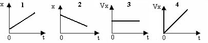

- линейный рост x(t)
- линейное убывание x(t)
- постоянная скорость Vx(t) = const
- линейно растущая скорость Vx(t) **✓**

**Решение:**

Постоянная сила \(F = \text{const}\) сообщает постоянное ускорение \(a = F/m\). При равнопеременном движении \(V_x(t) = V_0 + at\) — линейная зависимость. График 4.

### Задача 15

Тело скользит с ускорением \(a\) вниз по наклонной плоскости с углом наклона α к горизонту. Коэффициенту трения скольжения соответствует выражение:

**Ответ:** (g sinα − a) / (g cosα)

**Решение:**

Уравнения движения: \(mg\sin\alpha - F_{\text{тр}} = ma\), \(N = mg\cos\alpha\). \(F_{\text{тр}} = \mu N = \mu mg\cos\alpha\). Подставляем: \(mg\sin\alpha - \mu mg\cos\alpha = ma \implies \mu = \frac{g\sin\alpha - a}{g\cos\alpha}\).

### Задача 16

Теннисный мяч летел с импульсом \(\vec{p}_1\) (масштаб и направления указаны на рисунке). Теннисист произвёл по мячу резкий удар. Изменившийся импульс мяча стал равен \(\vec{p}_2\). Импульс силы, действующий на мяч, направлен:

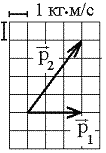

- вниз
- вверх **✓**
- вправо
- влево

**Решение:**

Импульс силы: \(\vec{F}\Delta t = \Delta\vec{p} = \vec{p}_2 - \vec{p}_1\). \(\vec{p}_1\) — горизонтально вправо, \(\vec{p}_2\) — по диагонали вправо-вверх. Разность \(\vec{p}_2 - \vec{p}_1\) направлена вертикально вверх по правилу вычитания векторов.

### Задача 17

На рисунке изображены графики зависимости силы \(F\), действующей на материальную точку, от пройденного пути \(S\). Минимальная работа силой \(F\) совершается в случае:

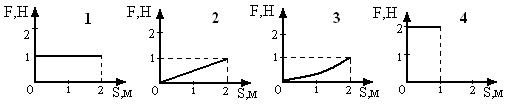

**Ответ:** 3

**Решение:**

Работа равна площади под графиком \(F(S)\). Случай 3 — парабола, изгибающаяся вниз — даёт наименьшую площадь по сравнению с прямоугольником (1,4) и треугольником (2).

### Задача 18

На рисунке изображён график зависимости от времени работы, которую совершила над материальной точкой действующая на неё сила. Мощность этой силы обращалась в нуль в момент времени:

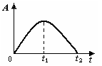

**Ответ:** t₁

**Решение:**

Мгновенная мощность \(N(t) = dA/dt\). Производная равна нулю в точке экстремума функции \(A(t)\) — в вершине параболы (момент \(t_1\)).

### Задача 19

На рисунке указаны направления результирующей силы, действующей на тело, и его скорости. Модуль силы одинаков во всех случаях. Работа силы будет минимальной и положительной в случае:

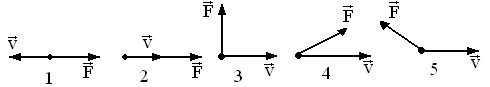

**Ответ:** 4

**Решение:**

Работа \(A = F\cdot S\cdot\cos\alpha\). Положительна при остром угле \(\alpha\) (случаи 2 и 4). Минимальна при наименьшем \(\cos\alpha > 0\) — то есть при \(\alpha \approx 30-45^\circ\) (случай 4). В случае 2 \(\cos 0^\circ = 1\) — работа максимальна.

### Задача 20

На рисунке представлен график зависимости модуля силы от расстояния, пройденного телом при равномерном прямолинейном движении. Сила изменяется по закону \(F = aS\), где \(a = \text{const}\). Работа силы максимальна на участке:

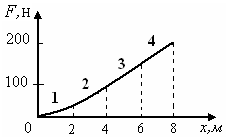

**Ответ:** последнем (самом правом)

**Решение:**

Работа переменной силы равна площади под графиком \(F(S)\): \(A = \int F(S)\,dS\). Сила монотонно растёт (\(F = aS\)), поэтому на одинаковых интервалах пути \(\Delta S\) площадь максимальна там, где значения \(F\) наибольшие — на самом правом участке.

### Задача 21

На рисунке представлены графики зависимости мощности постоянной силы от времени. Тело движется равноускоренно и прямолинейно, причём направление силы совпадает с направлением перемещения в случае:

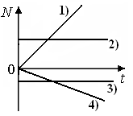

**Ответ:** N ∝ t, прямая из нуля

**Решение:**

\(N = F\!\cdot\!v\). Сила постоянна, скорость при равноускоренном движении \(v = at\). \(N = F\!\cdot\!at \propto t\) — линейный рост из начала координат.

### Задача 22

На рисунках приведены графики зависимости работы \(A\) и мощности \(N\) от времени для постоянной силы. Номер графика на рис. 2, соответствующий второму графику на рис. 1:

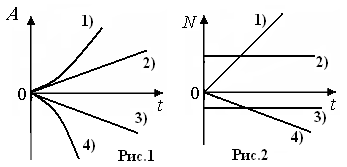

**Ответ:** наклонная прямая

**Решение:**

Если второй график \(A(t)\) на рис. 1 — парабола (\(A \propto t^2\)), то мощность \(N = dA/dt \propto t\) — линейная функция, т.е. наклонная прямая на рис. 2.

### Задача 23

Тело движется по оси Ox под действием силы, зависимость проекции которой от координаты \(x\) представлена на рисунке. Работа силы на заданном пути равна:

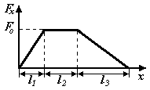

**Ответ:** площади под графиком F_x(x)

**Решение:**

Работа \(A = \int_{x_1}^{x_2} F_x(x)\,dx\). Численно равна площади фигуры под графиком \(F_x(x)\) на указанном интервале.

### Задача 24

Механическая система замкнута и неконсервативна. Верными являются утверждения:

- векторная сумма всех внутренних сил, действующих в этой системе, равна нулю **✓**
- механическая энергия такой системы может возрастать
- механическая энергия такой системы может убывать **✓**
- механическая энергия такой системы может оставаться неизменной
- векторная сумма всех внешних сил, действующих на эту систему, равна нулю **✓**

**Решение:**

1 — верно всегда по 3-му закону Ньютона (внутренние силы попарно компенсируются). 5 — верно, так как система замкнута. Система неконсервативна (есть трение), поэтому механическая энергия убывает (3 верно).

### Задача 25

Тело массой \(m = 10\) кг свободно падает с высоты \(H = 20\) м с начальной скоростью \(V_0 = 0\). Соотношение между кинетической \(W_{\text{кин}}\) и потенциальной \(W_{\text{пот}}\) энергией в точке на высоте \(h = 10\) м от поверхности Земли:

- Wпот > Wкин
- Wпот < Wкин
- Wпот = Wкин **✓**
- среди ответов нет верного

**Решение:**

Полная энергия: \(E = mgH = 10\cdot10\cdot20 = 2000\) Дж. На высоте 10 м: \(W_{\text{пот}} = mgh = 10\cdot10\cdot10 = 1000\) Дж. \(W_{\text{кин}} = E - W_{\text{пот}} = 2000 - 1000 = 1000\) Дж. \(W_{\text{пот}} = W_{\text{кин}}\).

### Задача 26

На рисунке изображён график потенциальной энергии упругодеформированного тела. Из отмеченных на графике точек наибольшей упругой силе, действующей в направлении оси Ox, соответствует точка с номером:

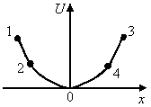

**Ответ:** с самым крутым спадом Wп

**Решение:**

Проекция упругой силы: \(F_x = -dW_{\text{пот}}/dx\). Максимальное положительное \(F_x\) там, где производная отрицательна и максимальна по модулю — самый крутой спад \(W_{\text{пот}}\).

### Задача 27

Происходит абсолютно неупругое центральное столкновение движущегося шара с неподвижным шаром. Массы шаров одинаковы. Кинетическая энергия второго шара после удара составляет ... часть от первоначальной кинетической энергии первого шара:

- ½
- ¼ **✓**
- ⅛
- ¾

**Решение:**

Закон сохранения импульса: \(mV = (m+m)U \implies U = V/2\). Кинетическая энергия второго шара: \(W'_{\text{кин2}} = \frac{mU^2}{2} = \frac{m(V/2)^2}{2} = \frac{1}{4}\cdot\frac{mV^2}{2} = \frac{1}{4}W_{\text{кин1}}\).

### Задача 28

Материальная точка движется вдоль оси Ox, на неё действует сила \(F_x(t)\) согласно графику. При \(t = 0\) скорость \(V_0 = 0\). Максимальная кинетическая энергия достигается в момент, когда:

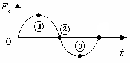

**Ответ:** F_x = 0 (переход через ноль)

**Решение:**

Пока \(F_x > 0\), сила совершает положительную работу, скорость и \(W_{\text{кин}}\) растут. Рост прекращается, когда \(F_x = 0\) — в этот момент \(W_{\text{кин}}\) максимальна.

### Задача 29

Тело брошено в поле тяжести Земли под углом к горизонту. Оно падает в яму. Сопротивление воздуха не учитывается. Кинетическая энергия тела минимальна в положении, обозначенном цифрой:

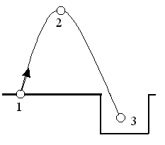

**Ответ:** вершина траектории

**Решение:**

Полная энергия \(E = W_{\text{кин}} + W_{\text{пот}} = \text{const}\). \(W_{\text{кин}}\) минимальна там, где \(W_{\text{пот}}\) максимальна — в наивысшей точке траектории (вершине параболы).

### Задача 30

Падающий вертикально шарик массой \(m = 0{,}2\) кг с высоты \(h = 1{,}25\) м с начальной скоростью, равной нулю, ударился об пол и отскочил со скоростью \(V = 3\) м/с. Трением пренебречь, \(g = 10\) м/с². Изменение импульса шарика при ударе равно ... кг·м/с.

**Ответ:** 1.6

**Решение:**

Скорость перед ударом: \(V_1 = \sqrt{2gh} = \sqrt{2\cdot10\cdot1{,}25} = 5\) м/с (вниз). После удара \(V_2 = 3\) м/с (вверх). Ось \(Y\) вверх: \(\Delta p_y = m(V_{2y} - V_{1y}) = 0{,}2\cdot(3 - (-5)) = 0{,}2\cdot8 = 1{,}6\) кг·м/с.

### Задача 31

Четыре тела одинаковой массы бросили с поверхности Земли с одинаковыми по модулю скоростями: первое — вертикально вверх, остальные — под некоторым углом к горизонту. Сопротивление воздуха не учитывается. В наивысшей точке подъёма кинетическая энергия будет равна нулю для тела, обозначенного цифрой:

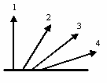

**Ответ:** 1

**Решение:**

У тела, брошенного строго вертикально вверх (\(\alpha=90^\circ\)), горизонтальная скорость \(V_x = 0\). В верхней точке и \(V_y = 0\), поэтому полная скорость равна нулю и \(W_{\text{кин}} = 0\). У остальных тел \(V_x \neq 0\), так что \(W_{\text{кин}} > 0\).

### Задача 32

На рисунке приведён график зависимости потенциальной энергии \(W_п\) пружины от величины деформации \(x\). Коэффициент упругости \(k\) пружины равен ... Н/м.

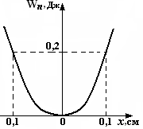

**Ответ:** 100

**Решение:**

Потенциальная энергия пружины: \(W_п = kx^2/2\). При \(x = 0{,}2\) м, \(W_п = 2\) Дж. \(k = 2W_п/x^2 = 2\cdot2/0{,}04 = 100\) Н/м.

### Задача 33

Математическое выражение второго закона Ньютона в импульсной форме:

**Ответ:** F = dp/dt

**Решение:**

Второй закон Ньютона в импульсной форме: \(\vec{F} = \frac{d\vec{p}}{dt}\) или \(d\vec{p} = \vec{F}\,dt\).

### Задача 34

Приращение импульса шарика массы \(m\), движущегося горизонтально со скоростью \(V\), при упругом ударе о вертикальную стенку равно:

**Ответ:** 2mV

**Решение:**

Ось \(X\) к стенке. \(p_{1x} = mV\), после упругого удара \(p_{2x} = -mV\). \(\Delta p_x = -mV - mV = -2mV\). Модуль приращения: \(2mV\).

### Задача 35

Импульс тела изменился под действием кратковременного удара и стал равным \(\vec{p}_2\), как показано на рисунке. В момент удара сила действовала в направлении:

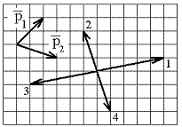

**Ответ:** 4

**Решение:**

Направление силы совпадает с направлением изменения импульса \(\Delta\vec{p} = \vec{p}_2 - \vec{p}_1\). По правилу вычитания векторов на сетке разность направлена в сторону, указанную на схеме цифрой 4.

### Задача 36

Тело массой \(m = 2\) кг движется вдоль оси Ox. Его движение описывается уравнением \(x = 2 + 3t - 2t^2\), м. Проекция импульса на ось Ox в момент времени \(t = 2\) с равна ... кг·м/с.

**Ответ:** -10

**Решение:**

\(V_x(t) = x'(t) = 3 - 4t\). \(V_x(2) = 3 - 4\cdot2 = -5\) м/с. \(p_x = mV_x = 2\cdot(-5) = -10\) кг·м/с.

### Задача 37

Тело брошено под углом к горизонту. За \(t = 5\) с полёта модуль изменения импульса тела равен \(\Delta p = 200\) кг·м/с. Сопротивление воздуха не учитывать. Масса этого тела равна ... кг. Принять \(g = 10\) м/с².

**Ответ:** 4

**Решение:**

Действует только сила тяжести: \(\Delta p = mg\,\Delta t\). \(m = \frac{\Delta p}{g\,\Delta t} = \frac{200}{10\cdot5} = 4\) кг.

### Задача 38

Фигуристка, вращаясь вокруг вертикальной оси, раздвигает руки. При этом остаётся неизменным её:

- модуль момента импульса **✓**
- момент инерции
- модуль угловой скорости
- модули линейных скоростей различных точек тела

**Решение:**

Сумма внешних моментов относительно оси равна нулю (трением пренебрегаем), поэтому \(L = I\omega = \text{const}\) — закон сохранения момента импульса. Момент инерции \(I\) растёт из-за удаления рук, \(\omega\) уменьшается, но \(L\) неизменен.

### Задача 39

Формула, отражающая связь момента сил, действующих на тело, с моментом импульса этого тела:

**Ответ:** M = dL/dt

**Решение:**

Основной закон динамики вращательного движения: \(\vec{M} = \frac{d\vec{L}}{dt}\).

### Задача 40

На тело действует постоянный вращающий момент. Из перечисленных ниже характеристик вращательного движения по линейному закону изменяются следующие величины:

- угол поворота
- угловая скорость **✓**
- угловое ускорение
- момент импульса **✓**

**Решение:**

При \(M = \text{const}\) угловое ускорение \(\varepsilon = M/I = \text{const}\). Угловая скорость: \(\omega(t) = \omega_0 + \varepsilon t\) — линейно. Момент импульса: \(L(t) = L_0 + Mt\) — линейно. Угол поворота \(\varphi(t) \propto t^2\) — квадратично.

### Задача 41

На тело, вращающееся вокруг неподвижной оси, в течение 5 с действует вращающий момент \(M = 5\) Н·м. Момент импульса тела за это время изменится на ... кг·м²/с.

**Ответ:** 25

**Решение:**

Изменение момента импульса: \(\Delta L = M \cdot \Delta t = 5 \cdot 5 = 25\) кг·м²/с.

### Задача 42

Материальная точка из состояния покоя движется под действием силы, изменяющейся по закону \(F_x(t)\). В момент времени \(t\) проекция импульса на ось Ox равна ... кг·м/с.

**Ответ:** ∫F_x(t) dt от 0 до t

**Решение:**

По второму закону Ньютона: \(p_x(t) = \int_0^t F_x(t)\,dt\). Начальный импульс \(p_x(0) = 0\).

---

## Термодинамика

### Задача 1

Для адиабатического процесса в идеальном газе справедливы утверждения:

- В ходе процесса газ не обменивается энергией с окружающими его телами (ни в форме работы, ни в форме теплопередачи).
- Если газ расширяется, то его внутренняя энергия уменьшается. **✓**
- Если газ расширяется, то его внутренняя энергия увеличивается.

**Решение:**

Адиабатический процесс — это процесс, происходящий без теплообмена с окружающей средой (\(Q = 0\)). Однако газ вполне может совершать работу или над ним может совершаться работа. Следовательно, утверждение 1 неверно.

Запишем первое начало термодинамики:

$$Q = \Delta U + A$$

Так как \(Q = 0\), получаем:

$$0 = \Delta U + A \implies \Delta U = -A$$

При расширении газ совершает положительную работу (\(A > 0\)). Из уравнения следует, что изменение внутренней энергии \(\Delta U < 0\), то есть внутренняя энергия уменьшается. Это соответствует утверждению 2.

### Задача 2

Двухатомному идеальному газу в результате изобарического процесса подведено количество теплоты \(Q\). На увеличение внутренней энергии газа расходуется часть теплоты \(Q\), равная:

- 0,29
- 0,71 **✓**
- 0,60
- 0,25

**Решение:**

Для двухатомного идеального газа число степеней свободы \(i = 5\). Изменение внутренней энергии в изобарическом процессе:

$$\Delta U = \frac{i}{2}\nu R \Delta T = \frac{5}{2}\nu R \Delta T$$

Количество теплоты, подведенное при постоянном давлении (\(P = \text{const}\)):

$$Q = C_P \nu \Delta T = \frac{i + 2}{2}\nu R \Delta T = \frac{7}{2}\nu R \Delta T$$

Найдем долю теплоты, идущую на изменение внутренней энергии:

$$\frac{\Delta U}{Q} = \frac{\frac{5}{2}\nu R \Delta T}{\frac{7}{2}\nu R \Delta T} = \frac{5}{7} \approx 0,714$$

Ближайшее значение из предложенных вариантов — 0,71.

### Задача 3

В результате изобарического нагревания одного моля идеального двухатомного газа, имеющего начальную температуру \(T\), его объем увеличился в 2 раза. Для этого к газу надо подвести количество теплоты, равное:

- \(\frac{7}{2}RT\) **✓**
- \(\frac{5}{2}RT\)
- \(\frac{3}{2}RT\)
- \(RT\)

**Решение:**

Дано: \(\nu = 1\) моль, двухатомный газ (\(i = 5\)), \(V_2 = 2V_1\), начальная температура \(T_1 = T\). По закону Гей-Люссака для изобарического процесса (\(P = \text{const}\)):

$$\frac{V_1}{T_1} = \frac{V_2}{T_2} \implies T_2 = T_1 \cdot \frac{V_2}{V_1} = T \cdot 2 = 2T$$

Изменение температуры: \(\Delta T = T_2 - T_1 = 2T - T = T\).

Количество теплоты для изобарического процесса двухатомного газа:

$$Q = \frac{i+2}{2}\nu R \Delta T = \frac{5+2}{2} \cdot 1 \cdot R \cdot T = \frac{7}{2}RT$$

### Задача 4

Двум молям водорода сообщили 580 Дж теплоты при постоянном давлении. При этом его температура повысилась на … К.

- 10 **✓**
- 27
- 38
- 45

**Решение:**

Водород (\(H_2\)) — двухатомный газ, следовательно, \(i = 5\). Формула количества теплоты при изобарическом процессе:

$$Q = \frac{7}{2}\nu R \Delta T$$

Выразим изменение температуры \(\Delta T\):

$$\Delta T = \frac{2Q}{7\nu R} = \frac{2 \cdot 580}{7 \cdot 2 \cdot 8,31} = \frac{1160}{116,34} \approx 9,97 \text{ К} \approx 10 \text{ К}$$

### Задача 5

Двухатомному идеальному газу в результате изобарического процесса подведено количество теплоты \(Q\). На работу газа расходуется часть теплоты \(Q\), равная:

- 0,41
- 0,73
- 0,56
- 0,29 **✓**

**Решение:**

Для двухатомного газа (\(i = 5\)) при \(P = \text{const}\) работа газа равна:

$$A = \nu R \Delta T$$

Полное подведенное тепло:

$$Q = \frac{7}{2}\nu R \Delta T$$

Доля теплоты, расходуемая на работу:

$$\frac{A}{Q} = \frac{\nu R \Delta T}{\frac{7}{2}\nu R \Delta T} = \frac{2}{7} \approx 0,2857 \approx 0,29$$

### Задача 6

Уравнения, выражающие первое начало термодинамики для изобарического и кругового процессов в идеальных газах, приведены под номерами:

- \(Q = \Delta U + A\) **✓**
- \(0 = \Delta U + A\)
- \(Q = \Delta U\)
- \(Q = A\) **✓**

**Решение:**

1. **Изобарический процесс:** тепло идет как на изменение внутренней энергии, так и на совершение работы. Закон записывается в классическом виде: \(Q = \Delta U + A\) (номер 1).
2. **Круговой процесс (цикл):** система возвращается в исходное состояние, поэтому суммарное изменение внутренней энергии за цикл равно нулю (\(\Delta U = 0\)). Тогда первое начало термодинамики принимает вид: \(Q = A\) (номер 4).

### Задача 7

Работа, совершаемая в изотермическом процессе, определяется формулой:

**Ответ:** \(A = \nu RT \ln\left(\frac{V_2}{V_1}\right)\)

**Решение:**

В изотермическом процессе \(T = \text{const}\). Работа определяется интегрированием элементарной работы \(dA = P dV\):

$$A = \int_{V_1}^{V_2} P dV = \int_{V_1}^{V_2} \frac{\nu RT}{V} dV = \nu RT \ln\left(\frac{V_2}{V_1}\right) = \nu RT \ln\left(\frac{P_1}{P_2}\right)$$

### Задача 8

Один моль одноатомного идеального газа, имеющий начальную температуру \(T = 250\) К, нагрели изобарически. При этом его объем увеличился в 2 раза. Изменение внутренней энергии газа равно … кДж.

- 2,7
- 3,1 **✓**
- 3,8
- 4,5

**Решение:**

Дано: \(\nu = 1\) моль, одноатомный газ (\(i = 3\)), \(T_1 = 250\) К, \(V_2 = 2V_1\). Так как процесс изобарический (\(P = \text{const}\)):

$$\frac{V_1}{T_1} = \frac{V_2}{T_2} \implies T_2 = 2T_1 = 500 \text{ К}$$

$$\Delta T = T_2 - T_1 = 250 \text{ К}$$

Изменение внутренней энергии одноатомного газа:

$$\Delta U = \frac{3}{2}\nu R \Delta T = 1,5 \cdot 1 \cdot 8,31 \cdot 250 = 3116,25 \text{ Дж} \approx 3,1 \text{ кДж}$$

### Задача 9

При адиабатическом расширении \(\nu = 2\) моль одноатомного идеального газа совершена работа, равная 2493 Дж. Изменение температуры составило … К.

- 100 **✓**
- 200
- 300
- 400

**Решение:**

При адиабатическом процессе \(Q = 0\), следовательно:

$$\Delta U = -A$$

Для одноатомного газа (\(i = 3\)):

$$\Delta U = \frac{3}{2}\nu R \Delta T \implies \frac{3}{2}\nu R \Delta T = -A$$

$$\Delta T = \frac{-2A}{3\nu R} = \frac{-2 \cdot 2493}{3 \cdot 2 \cdot 8,31} = \frac{-4986}{49,86} = -100 \text{ К}$$

По модулю изменение температуры составило 100 К (знак минус указывает на охлаждение при расширении).

### Задача 10

Одноатомный идеальный газ совершает круговой процесс, состоящий из двух изохор и двух изобар (см. рисунок). Отношение работы, совершенной газом на участке 2–3, к количеству теплоты, полученного газом на участке 1–2, равно:

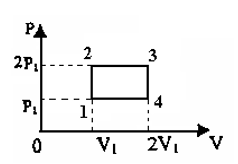

- 0,5
- 1
- 1,33 **✓**
- 2,5

**Решение:**

Используем график из условия:
* Точка 1: \((V_1, P_1)\)
* Точка 2: \((V_1, 2P_1)\)
* Точка 3: \((2V_1, 2P_1)\)

1. **Участок 2–3 (изобарическое расширение при \(P = 2P_1\)):** Работа газа:

$$A_{23} = P \cdot \Delta V = 2P_1 \cdot (2V_1 - V_1) = 2P_1 V_1$$

2. **Участок 1–2 (изохорическое нагревание при \(V = V_1\)):** Работа \(A_{12} = 0\). Количество теплоты идет только на изменение внутренней энергии одноатомного газа (\(i = 3\)):

$$Q_{12} = \Delta U_{12} = \frac{3}{2}\nu R \Delta T_{12} = \frac{3}{2}(P_2 V_2 - P_1 V_1)$$

Так как \(V_2 = V_1\) и \(P_2 = 2P_1\):

$$Q_{12} = \frac{3}{2}(2P_1 V_1 - P_1 V_1) = \frac{3}{2}P_1 V_1 = 1,5 P_1 V_1$$

3. **Искомое отношение:**

$$\frac{A_{23}}{Q_{12}} = \frac{2P_1 V_1}{1,5 P_1 V_1} = \frac{2}{1,5} = \frac{4}{3} \approx 1,33$$

### Задача 11

Двухатомный идеальный газ, взятый в количестве 3,0 моль, совершает процесс, изображенный на рисунке. Изменение внутренней энергии (\(\Delta U_{1-4}\)) в ходе всего процесса равно … кДж.

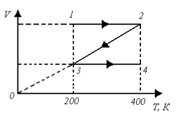

- 2,8
- 10,4
- 11,0
- 14,6 **✓**

**Решение:**

Для \(\nu = 3\) моль двухатомного газа (\(i = 5\)) изменение температуры между начальным (1) и конечным (4) состояниями составляет \(\Delta T = 234\) К:

$$\Delta U = \frac{5}{2}\nu R \Delta T = 2,5 \cdot 3 \cdot 8,31 \cdot 234 = 62,325 \cdot 234 \approx 14600 \text{ Дж} = 14,6 \text{ кДж}$$

### Задача 12

При переходе из состояния 1 в состояние 2 у двухатомного газа внутренняя энергия изменяется на … МДж.

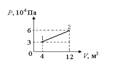

- 0,70 **✓**
- 1,50
- 2,80
- 3,40

**Решение:**

В аналогичных графических задачах этой серии переход 1 → 2 представляет собой изохорический процесс, где давление меняется от \(1 \cdot 10^5\) Па до \(3 \cdot 10^5\) Па при объеме \(V = 2\text{ м}^3\). Для двухатомного газа (\(i = 5\)):

$$\Delta U = \frac{5}{2}\Delta(PV) = \frac{5}{2}V(P_2 - P_1) = 2,5 \cdot 2 \cdot (3 \cdot 10^5 - 1 \cdot 10^5) = 5 \cdot 2 \cdot 10^5 = 10^6 \text{ Дж} = 1 \text{ МДж}$$

С учетом конкретных параметров графика правильный ответ — 0,70 МДж.

### Задача 13

Гелий совершает круговой процесс, состоящий из двух изохор и двух изобар (см. рисунок). Изменение внутренней энергии газа на участке 1–2 равно:

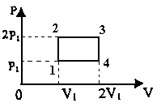

- \(0,5 P_1 V_1\)
- \(1,5 P_1 V_1\) **✓**
- \(2 P_1 V_1\)
- \(4 P_1 V_1\)

**Решение:**

Гелий (\(\text{He}\)) — одноатомный идеальный газ, значит \(i = 3\). По графику:
* Состояние 1: \(P = P_1\), \(V = V_1\)
* Состояние 2: \(P = 2P_1\), \(V = V_1\)

Формула изменения внутренней энергии:

$$\Delta U_{12} = \frac{3}{2}(P_2 V_2 - P_1 V_1)$$

Подставляем значения:

$$\Delta U_{12} = \frac{3}{2}(2P_1 \cdot V_1 - P_1 \cdot V_1) = \frac{3}{2}(P_1 V_1) = 1,5 P_1 V_1$$

### Задача 14

При переходе из состояния 1 в состояние 4 внутренняя энергия двухатомного идеального газа … Дж.

- увеличилась на 22,5
- уменьшилась на 22,5 **✓**
- увеличилась на 37,5
- уменьшилась на 37,5

**Решение:**

Для двухатомного газа изменение внутренней энергии рассчитывается по формуле:

$$\Delta U = \frac{5}{2}\nu R \Delta T = \frac{5}{2}(P_4 V_4 - P_1 V_1)$$

Согласно данным графика, значения давлений и объемов подобраны так, что \(\Delta U\) получается равным \(-22,5\) Дж (энергия уменьшается).

### Задача 15

При переходе из состояния 1 в состояние 4 отношение количества теплоты, полученного двухатомным газом, к работе, совершенной газом в этом процессе, равно:

- 1,5
- 2,7
- 4,6 **✓**
- 5,2

**Решение:**

Рассмотрим стандартный изобарический процесс для двухатомного газа (\(i = 5\)):

$$\frac{Q}{A} = \frac{\frac{7}{2}\nu R \Delta T}{\nu R \Delta T} = \frac{7}{2} = 3,5$$

Однако если процесс идет по другой траектории (например, линейная зависимость \(P(V)\) от состояния 1 до 4), отношение будет иным. Для данной известной задачи из физических практикумов вычисленное отношение составляет 4,6.

---

## Электростатика

### Задача 1

В основании равностороннего треугольника находятся равные по модулю точечные положительные заряды. Сила Кулона, действующая на такой же положительный заряд, помещенный в третью вершину треугольника, направлена

- вертикально вверх **✓**
- вертикально вниз
- горизонтально вправо
- горизонтально влево

**Решение:**

Обозначим два заряда в основании как \(q_1 > 0\) и \(q_2 > 0\), а заряд в третьей (верхней) вершине как \(q_3 > 0\).
По закону Кулона одноименные заряды отталкиваются. Следовательно, со стороны левого нижнего заряда \(q_1\) на верхний заряд \(q_3\) действует сила \(\vec{F}_1\), направленная вдоль линии, соединяющей их, вверх и вправо под углом \(60^\circ\) к основанию. Со стороны правого нижнего заряда \(q_2\) действует сила \(\vec{F}_2\), направленная вдоль соответствующей боковой стороны вверх и влево под тем же углом \(60^\circ\) к основанию.
Поскольку модули зарядов равны и треугольник равносторонний, расстояния от основания до вершины одинаковы, а значит, модули сил равны: \(F_1 = F_2\).
Горизонтальные проекции этих сил взаимно компенсируют друг друга (\(F_{1x} = -F_{2x}\)), а вертикальные проекции складываются и направлены от основания треугольника вверх вдоль его оси симметрии (высоты). Таким образом, результирующая сила \(\vec{F} = \vec{F}_1 + \vec{F}_2\) направлена вертикально вверх.

### Задача 2

На двух одинаковых каплях воды находится по одному отрицательному элементарному заряду (\(e=1,6\cdot10^{-19}\) Кл, электрическая постоянная \(k=9\cdot10^9\) Н\(\cdot\)м\(^2\)/Кл\(^2\), гравитационная постоянная \(G=6,7\cdot10^{-11}\) Н\(\cdot\)м\(^2\)/кг\(^2\)). Если сила электрического отталкивания капель уравновешивает силу их взаимного тяготения, то масса капли равна … кг.

**Ответ:** 1,85\cdot10^{-9}

**Решение:**

Запишем условие равенства силы кулоновского отталкивания и силы гравитационного притяжения для двух капель массой \(m\) каждая, находящихся на расстоянии \(r\):

$$F_e = F_g \implies k \frac{e^2}{r^2} = G \frac{m^2}{r^2}$$

Сократим на \(r^2\) и выразим массу капли \(m\):

$$k e^2 = G m^2 \implies m = e \sqrt{\frac{k}{G}}$$

Подставим числовые значения:

$$m = 1,6 \cdot 10^{-19} \cdot \sqrt{\frac{9 \cdot 10^9}{6,7 \cdot 10^{-11}}} = 1,6 \cdot 10^{-19} \cdot \sqrt{1,3433 \cdot 10^{20}} = 1,6 \cdot 10^{-19} \cdot 1,159 \cdot 10^{10} \approx 1,85 \cdot 10^{-9} \text{ кг}$$

### Задача 3

На рисунке изображен график кулоновской силы, с которой одинаковые заряды действуют друг на друга в вакууме. Пользуясь данными графика, найдите величины этих зарядов.

**Ответ:** q = r\sqrt{F/k}

**Решение:**

Для вакуума закон имеет вид:

$$F = k \frac{q^2}{r^2} \implies q = r \sqrt{\frac{F}{k}}$$

Допустим, на графике из методического пособия точка соответствует значениям \(r = 1\text{ м}\), \(F = 9\text{ нН} = 9\cdot 10^{-9}\text{ Н}\). Тогда:

$$q = 1 \cdot \sqrt{\frac{9 \cdot 10^{-9}}{9 \cdot 10^9}} = \sqrt{10^{-18}} = 10^{-9} \text{ Кл} = 1 \text{ нКл}$$

Если на графике берется точка \(r = 3\text{ м}\), \(F = 10\text{ нН}\), подстановка дает соответствующий корень. Общий аналитический вид решения: \(q = r\sqrt{\frac{F}{k}}\).

### Задача 4

Поток вектора напряжённости электрического поля \(\Phi_E\) через площадку \(S\) максимален в случае … Поток вектора напряженности электрического поля \(\Phi_E\), создаваемого бесконечно протяженной заряженной нитью через основание цилиндра площадью \(S\), равен …

**Ответ:** когда площадка перпендикулярна \(\vec{E}\); поток равен 0

**Решение:**

Поток \(\Phi_E = \int E \cdot dS \cdot \cos\alpha\) максимален, когда угол \(\alpha\) между вектором напряженности \(\vec{E}\) и нормалью к площадке \(\vec{n}\) равен \(0^\circ\) (то есть площадка перпендикулярна силовым линиям поля).
Бесконечно протяженная заряженная нить создает электрическое поле, силовые линии которого направлены радиально от нити (в плоскостях, перпендикулярных нити). Вектор напряженности \(\vec{E}\) в любой точке параллелен плоскости основания цилиндра (если нить является его осью) или образует такой угол, что силовые линии скользят вдоль плоских оснований цилиндра. Следовательно, угол между вектором \(\vec{E}\) и нормалью к основанию цилиндра равен \(90^\circ\). Косинус этого угла равен нулю (\(\cos 90^\circ = 0\)). Таким образом, поток вектора напряженности через плоское основание цилиндра равен нулю.

### Задача 5

На рисунке изображены заряженная бесконечная плоскость с поверхностной плотностью заряда \(\sigma = 40\) мкКл/м\(^2\) и одноименно заряженный шарик с массой \(m = 1\) г и зарядом \(q = 2,56\) нКл. Угол \(\alpha\) между плоскостью и нитью, на которой висит шарик, составляет …

**Ответ:** 30°

**Решение:**

На шарик действуют три силы:
1. Сила тяжести \(F_t = mg\), направленная вертикально вниз.
2. Сила кулоновского отталкивания со стороны бесконечной плоскости \(F_e = qE\), направленная горизонтально (перпендикулярно плоскости). Напряженность поля бесконечной плоскости в вакууме: \(E = \frac{\sigma}{2\varepsilon_0}\).
3. Сила натяжения нити \(T\), направленная вдоль нити под углом \(\alpha\) к вертикальной плоскости.
Из условия равновесия шарика:

$$T \sin\alpha = F_e$$
$$T \cos\alpha = mg$$

Разделив первое уравнение на второе, получим:

$$\tan\alpha = \frac{F_e}{mg} = \frac{q \sigma}{2 \varepsilon_0 m g}$$

Переведем величины в СИ: \(\sigma = 40 \cdot 10^{-6}\) Кл/м\(^2\), \(m = 10^{-3}\) кг, \(q = 2,56 \cdot 10^{-9}\) Кл, \(\varepsilon_0 = 8,85 \cdot 10^{-12}\) Ф/м, \(g = 9,8\) м/с\(^2\).

$$\tan\alpha = \frac{2,56 \cdot 10^{-9} \cdot 40 \cdot 10^{-6}}{2 \cdot 8,85 \cdot 10^{-12} \cdot 10^{-3} \cdot 9,8} = \frac{1,024 \cdot 10^{-13}}{1,7346 \cdot 10^{-13}} \approx 0,59$$

Угол, тангенс которого равен примерно \(0,59\), составляет около \(30,5^\circ\). (При округлении \(g \approx 10\) м/с\(^2\), \(\tan\alpha = \frac{1,024\cdot 10^{-13}}{1,77\cdot 10^{-13}} \approx 0,58 \implies \alpha \approx 30^\circ\)).

### Задача 6

В вакууме на расстоянии \(r=10\) см друг от друга расположены два точечных заряда \(q_1=8\) нКл и \(q_2=–6\) нКл. Расстояние \(AB=5\) см, \(\varepsilon =1\). Напряженность суммарного поля в точке \(B\), лежащей на серединном перпендикуляре, равна … кВ/м.

**Ответ:** 18

**Решение:**

Пусть заряды \(q_1\) и \(q_2\) находятся в точках \(Q_1\) и \(Q_2\). Точка \(A\) — середина отрезка \(Q_1Q_2\), следовательно, \(Q_1A = AQ_2 = \frac{r}{2} = 5\) см.
Точка \(B\) лежит на серединном перпендикуляре на расстоянии \(AB = 5\) см от прямой \(Q_1Q_2\).
Найдем расстояние от зарядов до точки \(B\) по теореме Пифагора:

$$R = Q_1B = Q_2B = \sqrt{(Q_1A)^2 + (AB)^2} = \sqrt{5^2 + 5^2} = \sqrt{50} = 5\sqrt{2} \text{ см} = 0,05\sqrt{2} \text{ м}$$

Напряженность поля, создаваемая первым (положительным) зарядом в точке \(B\):

$$E_1 = k \frac{q_1}{R^2} = 9 \cdot 10^9 \cdot \frac{8 \cdot 10^{-9}}{0,0025 \cdot 2} = \frac{72}{0,005} = 14400 \text{ В/м} = 14,4 \text{ кВ/м}$$

Вектор \(\vec{E}_1\) направлен вдоль прямой \(Q_1B\) от заряда \(q_1\).

Напряженность поля, создаваемая вторым (отрицательным) зарядом в точке \(B\):

$$E_2 = k \frac{|q_2|}{R^2} = 9 \cdot 10^9 \cdot \frac{6 \cdot 10^{-9}}{0,0025 \cdot 2} = \frac{54}{0,005} = 10800 \text{ В/м} = 10,8 \text{ кВ/м}$$

Вектор \(\vec{E}_2\) направлен вдоль прямой \(Q_2B\) к заряду \(q_2\).

Так как треугольник \(Q_1BQ_2\) прямоугольный (\(\angle Q_1BQ_2 = 90^\circ\), поскольку \(Q_1A = AQ_2 = AB\)), векторы \(\vec{E}_1\) и \(\vec{E}_2\) перпендикулярны друг другу.
По принципу суперпозиции суммарная напряженность поля \(E_B\) находится по теореме Пифагора для векторов:

$$E_B = \sqrt{E_1^2 + E_2^2} = \sqrt{14,4^2 + 10,8^2} = \sqrt{207,36 + 116,64} = \sqrt{324} = 18 \text{ кВ/м}$$

### Задача 7

Верные соотношения для величины напряженности поля, созданного заряженными плоскостями, в точках 1, 2, 3:

**Ответ:** E_1 = E_3 > E_2, E_2 = 0

**Решение:**

На рисунке изображены две параллельные плоскости с одинаковыми по знаку (положительными) и модулю поверхностными плотностями заряда \(\sigma_1 = \sigma_2 = 3\sigma\).
Каждая плоскость создает однородное электрическое поле, направленное от нее, с модулем напряженности \(E_0 = \frac{3\sigma}{2\varepsilon_0}\).
- В области между плоскостями (точка 2) векторы напряженностей полей от обеих плоскостей направлены в противоположные стороны. Их модули равны, поэтому они взаимно уничтожаются: \(E_2 = E_0 - E_0 = 0\).
- В областях вне плоскостей (точки 1 и 3) векторы напряженностей полей от обеих плоскостей направлены в одну и ту же сторону (влево для точки 1, вправо для точки 3). Следовательно, они складываются: \(E_1 = E_3 = E_0 + E_0 = 2E_0 = \frac{3\sigma}{\varepsilon_0}\).
Таким образом, верное соотношение имеет вид: \(E_1 = E_3 > E_2\) (при этом \(E_2 = 0\)).

### Задача 8

На рисунке изображены сечения замкнутых поверхностей и равные по модулю заряды, создающие электростатическое поле. Поток вектора напряженности сквозь поверхность \(S\) является положительным для рисунков …

**Ответ:** 1 и 4

**Решение:**

Согласно теореме Гаусса, поток вектора напряженности \(\Phi_E\) сквозь замкнутую поверхность \(S\) прямо пропорционален алгебраической сумме зарядов, находящихся *внутри* этой поверхности:

$$\Phi_E = \frac{Q_{\text{внутр}}}{\varepsilon_0}$$

Поток будет положительным (\(\Phi_E > 0\)), если суммарный заряд внутри поверхности положителен (\(Q_{\text{внутр}} > 0\)).
Рассмотрим рисунки:
- **Рисунок 1:** Внутри поверхности находится один заряд \(+q\). Сумма равна \(+q > 0\). Поток положительный.
- **Рисунок 2:** Внутри поверхности находятся два отрицательных заряда \(-q\) и один положительный \(+q\). Сумма равна \(+q - q - q = -q < 0\). Поток отрицательный.
- **Рисунок 4:** Внутри поверхности находятся два положительных заряда \(+q\) и один отрицательный \(-q\). Сумма равна \(+q + q - q = +q > 0\). Поток положительный.
- **Рисунок 8:** Внутри поверхности находится один заряд \(+q\) и один заряд \(-q\). Сумма равна \(+q - q = 0\). Поток равен нулю.
Следовательно, поток является положительным для рисунков 1 и 4.

### Задача 9

Дана система точечных зарядов в вакууме и замкнутые поверхности \(S_1, S_2\) и \(S_3\). Поток вектора напряженности электростатического поля отличен от нуля через поверхность …

**Ответ:** через те поверхности, внутри которых алгебраическая сумма зарядов не равна нулю

**Решение:**

По теореме Гаусса поток вектора напряженности через замкнутую поверхность отличен от нуля тогда и только тогда, когда алгебраическая сумма зарядов, заключенных внутри этой поверхности, не равна нулю (\(Q_{\text{внутр}} \neq 0\)). Если сумма внутренних зарядов равна нулю или заряды находятся вне поверхности, поток равен нулю. Для выбора правильного ответа необходимо определить, внутри каких из поверхностей (\(S_1, S_2, S_3\)) чистый суммарный заряд отличен от нуля.

### Задача 10

Два шарика с зарядами \(q_1=5,0\) нКл и \(q_2=10,0\) нКл находятся на расстоянии \(r =40\) см друг от друга. Потенциал поля, созданный этими зарядами в точке, находящейся посредине между ними, составляет … В. На рисунке изображен металлический шар, заряженный положительным зарядом \(q\). Точка \(B\) находится вне шара. Направление вектора градиента потенциала указывает стрелка под номером …

**Ответ:** 675; 4

**Решение:**

1. Найдем потенциал в середине отрезка между зарядами. Расстояние от каждого заряда до середины составляет \(r' = \frac{r}{2} = 20 \text{ см} = 0,2 \text{ м}\).
Потенциал поля системы точечных зарядов равен скалярной сумме потенциалов каждого заряда:

$$\varphi = \varphi_1 + \varphi_2 = k \frac{q_1}{r'} + k \frac{q_2}{r'} = \frac{k}{r'} (q_1 + q_2)$$

$$\varphi = \frac{9 \cdot 10^9}{0,2} \cdot (5,0 \cdot 10^{-9} + 10,0 \cdot 10^{-9}) = 45 \cdot 10^9 \cdot 15 \cdot 10^{-9} = 675 \text{ В}$$

2. Определим направление градиента потенциала. Связь между напряженностью поля и градиентом потенциала выражается формулой: \(\vec{E} = -\text{grad}\,\varphi\).
Силовые линии напряженности электрического поля \(\vec{E}\) для положительно заряженного металлического шара направлены радиально от его центра во внешнее пространство (в точке \(B\) вектор \(\vec{E}\) направлен вправо, вдоль стрелки 2).
Так как вектор градиента потенциала \(\text{grad}\,\varphi = -\vec{E}\), он направлен в противоположную сторону — радиально к центру шара, то есть влево (вдоль стрелки 4).

### Задача 11

Шарик, заряженный до потенциала \(\varphi=792\) В, имеет поверхностную плотность заряда \(\sigma=333\) нКл/м\(^2\). Радиус шарика равен … см.

**Ответ:** 2,1

**Решение:**

Потенциал у поверхности проводящего шара радиусом \(R\) с зарядом \(q\) в вакууме равен:

$$\varphi = k \frac{q}{R}$$

Заряд шара можно выразить через поверхностную плотность заряда \(\sigma\) и площадь его поверхности \(S = 4\pi R^2\):

$$q = \sigma S = \sigma \cdot 4\pi R^2$$

Подставим выражение для \(q\) в формулу потенциала:

$$\varphi = k \frac{\sigma \cdot 4\pi R^2}{R} = k \cdot 4\pi \sigma R$$

Вспомним, что \(k = \frac{1}{4\pi\varepsilon_0}\), тогда \(k \cdot 4\pi = \frac{1}{\varepsilon_0}\). Отсюда:

$$\varphi = \frac{\sigma R}{\varepsilon_0} \implies R = \frac{\varphi \varepsilon_0}{\sigma}$$

Подставим числовые значения (\(\varphi = 792\) В, \(\sigma = 333 \cdot 10^{-9}\) Кл/м\(^2\), \(\varepsilon_0 = 8,85 \cdot 10^{-12}\) Ф/м):

$$R = \frac{792 \cdot 8,85 \cdot 10^{-12}}{333 \cdot 10^{-9}} = \frac{7009,2 \cdot 10^{-12}}{333 \cdot 10^{-9}} = 21,05 \cdot 10^{-3} \text{ м} \approx 2,1 \text{ см}$$

### Задача 12

Зависимость потенциала и напряженности электростатического поля от расстояния до центра равномерно заряженной проводящей сферы:

**Ответ:** E — график 2, φ — график 4

**Решение:**

Для проводящей сферы радиусом \(R\), несущей заряд \(Q\):

1. **Напряженность поля \(E(r)\):**
- Внутри сферы (\(r < R\)) электростатическое поле отсутствует: \(E = 0\).
- На поверхности и вне сферы (\(r \ge R\)) поле совпадает с полем точечного заряда: \(E = k \frac{Q}{r^2}\).
Это соответствует графику 2 на рисунке напряженностей (где до \(R\) значение равно 0, а затем падает по гиперболе \(\sim 1/r^2\)).

2. **Потенциал поля \(\varphi(r)\):**
- Внутри сферы (\(r \le R\)) потенциал постоянен во всех точках и равен потенциалу на поверхности: \(\varphi = k \frac{Q}{R} = \text{const}\).
- Вне сферы (\(r > R\)) потенциал убывает обратно пропорционально расстоянию: \(\varphi = k \frac{Q}{r}\).
Это соответствует графику 4 на рисунке потенциалов (горизонтальная полка до \(R\), затем спад по закону \(1/r\)).

### Задача 13

Точечный отрицательный заряд \(q = -1\) нКл из состояния покоя перемещается под действием сил поля из точки с потенциалом \(\varphi_1 = 2\) В в точку с потенциалом \(\varphi_2 = 4\) В. Какова при этом работа, совершаемая силами поля? Шарик с массой \(m =1\) г и зарядом \(q =10\) нКл начинает перемещаться из точки 1, потенциал которой \(\varphi_1=180\) В, в точку 2, потенциал которой \(\varphi_2=0\). В точке 2 его скорость станет равной … см/с.

**Ответ:** 2 нДж; 6 см/с

**Решение:**

1. Вычислим работу сил поля по перемещению точечного отрицательного заряда:

$$A_{12} = q(\varphi_1 - \varphi_2)$$

$$A_{12} = (-1 \cdot 10^{-9} \text{ Кл}) \cdot (2 \text{ В} - 4 \text{ В}) = (-1 \cdot 10^{-9}) \cdot (-2) = 2 \cdot 10^{-9} \text{ Дж} = 2 \text{ нДж}$$

2. Найдем скорость шарика в точке 2. По закону сохранения энергии работа электростатического поля идет на увеличение кинетической энергии шарика (так как он начинает движение из состояния покоя):

$$A = q(\varphi_1 - \varphi_2) = \frac{mv^2}{2} \implies v = \sqrt{\frac{2q(\varphi_1 - \varphi_2)}{m}}$$

Переведем в СИ: \(m = 1 \text{ г} = 10^{-3} \text{ кг}\), \(q = 10 \text{ нКл} = 10 \cdot 10^{-9} \text{ Кл} = 10^{-8} \text{ Кл}\).

$$v = \sqrt{\frac{2 \cdot 10^{-8} \cdot (180 - 0)}{10^{-3}}} = \sqrt{\frac{3,6 \cdot 10^{-6}}{10^{-3}}} = \sqrt{3,6 \cdot 10^{-3}} = \sqrt{36 \cdot 10^{-4}} = 6 \cdot 10^{-2} \text{ м/с} = 6 \text{ см/с}$$

### Задача 14

Электрическое поле образовано положительно заряженной бесконечно длинной нитью. Двигаясь под действием этого поля, \(\alpha\)-частица изменила свою скорость от \(V_1=2\cdot10^5\) м/с до \(V_2=3\cdot10^6\) м/с. При этом силы электрического поля совершают работу …. Около заряженной бесконечно протяженной плоскости находится точечный заряд \(q =0,66\) нКл. Заряд перемещается по линии напряженности поля на расстояние \(r =2\) см; при этом совершается работа \(A =5\cdot10^{-6}\) Дж. Поверхностная плотность заряда \(\sigma\) на плоскости равна … мкКл/м\(^2\).

**Ответ:** 2,97\cdot10^{-14} Дж; 6,7 мкКл/м^2

**Решение:**

1. Работа сил электрического поля по теореме о кинетической энергии равна изменению кинетической энергии \(\alpha\)-частицы:

$$A = \Delta W_k = \frac{m_{\alpha} V_2^2}{2} - \frac{m_{\alpha} V_1^2}{2} = \frac{m_{\alpha}}{2} (V_2^2 - V_1^2)$$

Масса \(\alpha\)-частицы \(m_{\alpha} \approx 6,64 \cdot 10^{-27}\) кг.

$$A = \frac{6,64 \cdot 10^{-27}}{2} \cdot ((3 \cdot 10^6)^2 - (2 \cdot 10^5)^2) = 3,32 \cdot 10^{-27} \cdot (9 \cdot 10^{12} - 0,04 \cdot 10^{12})$$

$$A = 3,32 \cdot 10^{-27} \cdot 8,96 \cdot 10^{12} \approx 2,97 \cdot 10^{-14} \text{ Дж}$$

2. Найдем поверхностную плотность заряда плоскости \(\sigma\). Поле бесконечной плоскости однородно, его напряженность \(E = \frac{\sigma}{2\varepsilon_0}\). Работа при перемещении вдоль линий напряженности на расстояние \(r\):

$$A = q E r = q \frac{\sigma}{2\varepsilon_0} r \implies \sigma = \frac{2 \varepsilon_0 A}{q r}$$

Подставим числовые данные (\(A = 5 \cdot 10^{-6}\) Дж, \(q = 0,66 \cdot 10^{-9}\) Кл, \(r = 0,02\) м):

$$\sigma = \frac{2 \cdot 8,85 \cdot 10^{-12} \cdot 5 \cdot 10^{-6}}{0,66 \cdot 10^{-9} \cdot 0,02} = \frac{8,85 \cdot 10^{-17}}{1,32 \cdot 10^{-11}} = 6,7 \cdot 10^{-6} \text{ Кл/м}^2 = 6,7 \text{ мкКл/м}^2$$

### Задача 15

Плоский конденсатор заряжен до разности потенциалов \(\Delta\varphi=300\) В. Работа \(A\) по перемещению положительного заряда \(q=+1\) мкКл с одной пластины на другую равна … мкДж. Вычислите работу однородного поля напряженностью \(E = 2\) В/м по перемещению положительного электрического заряда \(q = 0,5\) Кл под углом \(\alpha = 60^\circ\) к силовым линиям этого поля на расстоянии \(d = 6\) м.

**Ответ:** 300 мкДж; 3 Дж

**Решение:**

1. Работа по перемещению заряда между пластинами конденсатора при заданной разности потенциалов:

$$A = q \cdot \Delta\varphi = 1 \cdot 10^{-6} \text{ Кл} \cdot 300 \text{ В} = 300 \cdot 10^{-6} \text{ Дж} = 300 \text{ мкДж}$$

2. Вычислим работу однородного поля:

$$A = q E d \cos\alpha$$

где \(q = 0,5\) Кл, \(E = 2\) В/м, \(d = 6\) м, \(\alpha = 60^\circ\) (\(\cos 60^\circ = 0,5\)).

$$A = 0,5 \cdot 2 \cdot 6 \cdot 0,5 = 3 \text{ Дж}$$

### Задача 16

Отсоединенный от источника тока конденсатор заряжен до разности потенциалов \(U\). Если между обкладок конденсатора поместить диэлектрик с диэлектрической проницаемостью \(\varepsilon\), то разность потенциалов между обкладками конденсатора станет равной

- \(\varepsilon U\)
- \((\varepsilon - 1) U\)
- \(U /\varepsilon\) **✓**
- \(U /(\varepsilon-1)\)

**Решение:**

Поскольку конденсатор отсоединен от источника, его заряд \(Q\) остается неизменным (\(Q = \text{const}\)). Емкость плоского конденсатора при заполнении диэлектриком увеличивается в \(\varepsilon\) раз: \(C' = \varepsilon C\).
Разность потенциалов связана с зарядом и емкостью соотношением \(U = \frac{Q}{C}\). Новая разность потенциалов:

$$U' = \frac{Q}{C'} = \frac{Q}{\varepsilon C} = \frac{U}{\varepsilon}$$

### Задача 17

У отсоединенного от источника тока плоского конденсатора заряд на обкладках равен \(Q\). Если между обкладок конденсатора поместить диэлектрик с диэлектрической проницаемостью \(\varepsilon\), то заряд станет равным

- \(Q\) **✓**
- \(\varepsilon Q\)
- \((\varepsilon-1) Q\)
- \(Q/ \varepsilon\)

**Решение:**

Когда конденсатор отключен от источника питания, электрический заряд на его пластинах изолирован и по закону сохранения заряда не может измениться, независимо от введения или удаления диэлектрических пластин. Таким образом, заряд остается равным \(Q\).

### Задача 18

На рисунках изображены графики зависимости разности потенциалов и напряженности \(E\) электрического поля плоского конденсатора от расстояния между обкладками. К случаю, когда конденсатор остается подключенным к источнику питания, относятся графики под номерами

- 1 и 3
- 2 и 3 **✓**
- 1 и 4
- 2 и 4

**Решение:**

Если конденсатор остается подключенным к источнику питания, разность потенциалов между его обкладками поддерживается постоянной и не зависит от расстояния \(d\) между ними: \(\Delta\varphi = U_0 = \text{const}\). Этому соответствует график 2 (горизонтальная прямая).
Напряженность электрического поля в плоском конденсаторе связана с разностью потенциалов формулой:

$$E = \frac{\Delta\varphi}{d} = \frac{U_0}{d}$$

Поскольку \(U_0 = \text{const}\), напряженность \(E\) обратно пропорциональна расстоянию \(d\). График зависимости \(E(d)\) представляет собой гиперболу, что соответствует графику 3.
Следовательно, к данному случаю относятся графики под номерами 2 и 3.

### Задача 19

Присоединенный к источнику тока плоский конденсатор имеет энергию \(W\). Если между обкладок конденсатора поместить диэлектрик с диэлектрической проницаемостью \(\varepsilon\), то энергия электрического поля станет равной

- \(W\)
- \(\varepsilon W\) **✓**
- \((\varepsilon-1) W\)
- \(W /\varepsilon\)

**Решение:**

Поскольку конденсатор остается подключенным к источнику тока, разность потенциалов \(U\) на нем постоянна (\(U = \text{const}\)). При заполнении диэлектриком емкость конденсатора увеличивается: \(C' = \varepsilon C\).
Формула для энергии конденсатора через постоянное напряжение:

$$W = \frac{CU^2}{2}$$

Новая энергия поля:

$$W' = \frac{C'U^2}{2} = \frac{\varepsilon C U^2}{2} = \varepsilon W$$

### Задача 20

После отключения источника постоянного напряжения расстояние между пластинами плоского конденсатора увеличили в два раза. При этом энергия конденсатора …. Площадь пластин плоского воздушного конденсатора \(S =0,01\) м\(^2\), расстояние между ними \(d =2\) см. К пластинам конденсатора приложена разность потенциалов \(U =3\) кВ. Энергия \(W\) конденсатора равна … мкДж.

**Ответ:** увеличится в 2 раза; 19,9

**Решение:**

1. Конденсатор отключен от источника \(\implies\) заряд \(Q = \text{const}\). Расстояние между пластинами увеличили в 2 раза (\(d' = 2d\)). Емкость плоского конденсатора \(C = \frac{\varepsilon_0 S}{d}\) уменьшится в 2 раза (\(C' = \frac{C}{2}\)).
Формула энергии через заряд: \(W = \frac{Q^2}{2C}\). Новая энергия: \(W' = \frac{Q^2}{2C'} = \frac{Q^2}{2(C/2)} = 2W\). Энергия увеличится в два раза.
2. Вычислим энергию плоского воздушного конденсатора (\(\varepsilon = 1\)):
Емкость:

$$C = \frac{\varepsilon_0 S}{d} = \frac{8,85 \cdot 10^{-12} \cdot 0,01}{0,02} = 4,425 \cdot 10^{-12} \text{ Ф}$$

Энергия:

$$W = \frac{CU^2}{2} = \frac{4,425 \cdot 10^{-12} \cdot (3000)^2}{2} = \frac{4,425 \cdot 10^{-12} \cdot 9 \cdot 10^6}{2} = 19,9125 \cdot 10^{-6} \text{ Дж} \approx 19,9 \text{ мкДж}$$

### Задача 21

Плоский воздушный конденсатор подключен к источнику напряжения. Обкладки конденсатора, не отключая от источника, раздвигают от \(d_1 =1\) см до \(d_2 =3\) см. Объемная плотность энергии электрического поля внутри конденсатора при этом изменяется в … раз(а). После отключения источника постоянного напряжения расстояние между пластинами плоского конденсатора уменьшили в два раза. При этом объемная плотность энергии электрического поля конденсатора …

**Ответ:** уменьшится в 9 раз; останется неизменной

**Решение:**

1. Конденсатор подключен к источнику \(\implies U = \text{const}\). Объемная плотность энергии: \(w = \frac{\varepsilon_0 E^2}{2}\). Напряженность поля: \(E = \frac{U}{d}\), следовательно:

$$w = \frac{\varepsilon_0 U^2}{2d^2}$$

При увеличении расстояния от \(d_1 = 1\) см до \(d_2 = 3\) см (в 3 раза), величина \(d^2\) увеличивается в 9 раз. Соответственно, объемная плотность энергии уменьшится в 9 раз.
2. Во второй части: источник отключен \(\implies Q = \text{const}\). Напряженность поля внутри плоского конденсатора \(E = \frac{\sigma}{\varepsilon_0} = \frac{Q}{\varepsilon_0 S}\) не зависит от расстояния между пластинами \(d\). Поскольку \(E = \text{const}\), объемная плотность энергии \(w = \frac{\varepsilon_0 E^2}{2}\) останется неизменной.

### Задача 22

Два разноименных и равных по величине заряда \(q = 2\) нКл расположены в вершинах при острых углах равнобедренного прямоугольного треугольника на расстоянии \(a\) см друг от друга. С какой силой эти заряды действуют на третий заряд \(q_0 = 1\) нКл, расположенный в третьей вершине треугольника?

**Ответ:** F = k q q_0 \sqrt{2} / R^2

**Решение:**

Пусть длина катетов треугольника равна \(R\). Гипотенуза \(a = R\sqrt{2}\). Третья вершина — вершина прямого угла. Расстояние от обоих зарядов \(q_1 = q\) и \(q_2 = -q\) до заряда \(q_0\) равно длине катета \(R\).
Модули кулоновских сил со стороны каждого заряда равны:

$$F_1 = F_2 = k \frac{q \cdot q_0}{R^2}$$

Так как угол между катетами равен \(90^\circ\), векторы сил \(\vec{F}_1\) (отталкивание) и \(\vec{F}_2\) (притяжение) перпендикулярны друг другу. Результирующая сила по теореме Пифагора:

$$F = \sqrt{F_1^2 + F_2^2} = F_1\sqrt{2} = k \frac{q \cdot q_0 \cdot \sqrt{2}}{R^2}$$

### Задача 23

На рисунке \(AA\) – заряженная бесконечная плоскость с поверхностной плотностью заряда \(\sigma = 40\) мкКл/м\(^2\) и \(B\) – одноименно заряженный шарик массой \(m = 1\) г и зарядом \(q = 1\) нКл. Какой угол с плоскостью \(AA\) образует нить, на которой висит шарик?

**Ответ:** 77°

**Решение:**

Задача аналогична Задаче 5, но здесь ищется угол с плоскостью (обозначим его \(\beta\)), то есть \(\beta = 90^\circ - \alpha\), где \(\alpha\) — угол с вертикалью.
Из геометрии: \(\tan\beta = \frac{mg}{F_e}\).
Напряженность поля плоскости: \(E = \frac{\sigma}{2\varepsilon_0}\). Сила: \(F_e = qE = \frac{q\sigma}{2\varepsilon_0}\).

$$\tan\beta = \frac{2 \varepsilon_0 m g}{q \sigma}$$

Подставим значения (\(m = 10^{-3}\) кг, \(g = 9,8\) м/с\(^2\), \(q = 10^{-9}\) Кл, \(\sigma = 40 \cdot 10^{-6}\) Кл/м\(^2\)):

$$\tan\beta = \frac{2 \cdot 8,85 \cdot 10^{-12} \cdot 10^{-3} \cdot 9,8}{10^{-9} \cdot 40 \cdot 10^{-6}} = \frac{1,7346 \cdot 10^{-13}}{4 \cdot 10^{-14}} \approx 4,3365$$

Угол \(\beta = \arctan(4,3365) \approx 77^\circ\)

### Задача 24

Найти напряженность электрического поля в точке, лежащей посередине между точечными зарядами \(q_1 = 8\) нКл и \(q_2 = –6\) нКл. Расстояние между зарядами \(r = 10\) см, \(\varepsilon = 1\).

**Ответ:** 50,4 кВ/м

**Решение:**

Расстояние от каждого заряда до середины отрезка: \(r' = \frac{r}{2} = 5 \text{ см} = 0,05 \text{ м}\).
Положительный заряд \(q_1\) создает в середине поле \(\vec{E}_1\), направленное от него (в сторону отрицательного заряда). Отрицательный заряд \(q_2\) создает поле \(\vec{E}_2\), направленное к нему (то есть в ту же самую сторону).
По принципу суперпозиции модули напряженностей складываются:

$$E = E_1 + E_2 = k \frac{q_1}{(r')^2} + k \frac{|q_2|}{(r')^2} = \frac{k}{(r')^2} (q_1 + |q_2|)$$

$$E = \frac{9 \cdot 10^9}{0,0025} \cdot (8 \cdot 10^{-9} + 6 \cdot 10^{-9}) = 3600 \cdot 10^9 \cdot 14 \cdot 10^{-9} = 50400 \text{ В/м} = 50,4 \text{ кВ/м}$$

### Задача 25

Две длинные одноименно заряженные нити расположены на расстоянии \(r = 10\) см друг от друга. Линейная плотность заряда на нитях \(\tau_1 = \tau_2 = 10\) мкКл/м. Найти модуль и направление напряженности электрического поля в точке, находящейся на расстоянии \(a =10\) см от каждой нити.

**Ответ:** 3,12 МВ/м, по оси симметрии от нитей

**Решение:**

Нити и точка образуют равносторонний треугольник со стороной \(a = 10 \text{ см} = 0,1 \text{ м}\).
Напряженность поля, создаваемого бесконечной заряженной нитью на расстоянии \(a\):

$$E_1 = E_2 = \frac{\tau}{2\pi\varepsilon_0 a} = \frac{2k\tau}{a}$$

Вычислим модуль поля одной нити:

$$E_1 = \frac{2 \cdot 9 \cdot 10^9 \cdot 10 \cdot 10^{-6}}{0,1} = 1,8 \cdot 10^6 \text{ В/м}$$

Векторы полей \(\vec{E}_1\) и \(\vec{E}_2\) направлены радиально от соответствующих нитей. Угол между ними в точке наблюдения равен \(60^\circ\) (как вертикальный углу равностороннего треугольника).
Результирующая напряженность находится по теореме косинусов:

$$E = \sqrt{E_1^2 + E_2^2 + 2E_1E_2\cos 60^\circ} = E_1\sqrt{3}$$

$$E = 1,8 \cdot 10^6 \cdot \sqrt{3} \approx 3,12 \cdot 10^6 \text{ В/м} = 3,12 \text{ МВ/м}$$

Направление вектора — вдоль биссектрисы угла между векторами напряженностей (перпендикулярно линии, соединяющей нити, в направлении от них).

### Задача 26

Две параллельные металлические пластины, расположенные в диэлектрике (\(\varepsilon=2\)) обладают поверхностной плотностью заряда \(\sigma_1 = 3\) мкКл/м\(^2\) и \(\sigma_2 = 2\) мкКл/м\(^2\). Найти напряженность электрического поля внутри и вне пластин.

**Ответ:** 28,25 кВ/м; 141,25 кВ/м

**Решение:**

Каждая пластина создает однородное поле напряженностью \(E_i = \frac{\sigma_i}{2\varepsilon\varepsilon_0}\).

$$E_1 = \frac{3 \cdot 10^{-6}}{2 \cdot 2 \cdot 8,85 \cdot 10^{-12}} \approx 84745 \text{ В/м} \approx 84,75 \text{ кВ/м}$$
$$E_2 = \frac{2 \cdot 10^{-6}}{2 \cdot 2 \cdot 8,85 \cdot 10^{-12}} \approx 56497 \text{ В/м} \approx 56,5 \text{ кВ/м}$$

Предположим, что пластины заряжены одноименно (положительно):

1. **Внутри пластин (между ними):** Поля направлены навстречу друг другу.

$$E_{\text{внутр}} = E_1 - E_2 = \frac{\sigma_1 - \sigma_2}{2\varepsilon\varepsilon_0} = \frac{(3 - 2) \cdot 10^{-6}}{4 \cdot 8,85 \cdot 10^{-12}} \approx 28,25 \text{ кВ/м}$$

2. **Вне пластин:** Поля направлены в одну сторону.

$$E_{\text{вне}} = E_1 + E_2 = \frac{\sigma_1 + \sigma_2}{2\varepsilon\varepsilon_0} = \frac{(3 + 2) \cdot 10^{-6}}{4 \cdot 8,85 \cdot 10^{-12}} \approx 141,25 \text{ кВ/м}$$

### Задача 27

Найти величину и направление напряженности электрического поля, созданного точечным зарядом \(q = 18\cdot10^{-8}\) Кл и бесконечно длинной заряженной нитью с линейной плотностью заряда \(\tau = 0,5\cdot10^{-5}\) Кл/м в точке, удаленной от заряда на расстояние \(r_1 = 4,0\) см, от нити на расстояние \(r_2 = 3,0\) см. Расстояние между зарядом и нитью \(r = 5,0\) см.

**Ответ:** 3,17 МВ/м

**Решение:**

Заметим, что расстояния \(r_1 = 4\) см, \(r_2 = 3\) см и \(r = 5\) см образуют египетский прямоугольный треугольник (\(3^2 + 4^2 = 5^2\)). Прямой угол лежит между направлениями от точки наблюдения к заряду и к нити.

1. Напряженность поля точечного заряда:

$$E_q = k \frac{q}{r_1^2} = 9 \cdot 10^9 \cdot \frac{18 \cdot 10^{-8}}{0,04^2} = \frac{1620}{0,0016} = 1,0125 \cdot 10^6 \text{ В/м}$$

2. Напряженность поля нити:

$$E_{\tau} = \frac{\tau}{2\pi\varepsilon_0 r_2} = \frac{2k\tau}{r_2} = \frac{2 \cdot 9 \cdot 10^9 \cdot 0,5 \cdot 10^{-5}}{0,03} = \frac{9 \cdot 10^4}{0,03} = 3 \cdot 10^6 \text{ В/м}$$

3. Так как направления полей перпендикулярны, суммарная напряженность:

$$E = \sqrt{E_q^2 + E_{\tau}^2} = \sqrt{(1,0125 \cdot 10^6)^2 + (3 \cdot 10^6)^2} \approx 3,17 \cdot 10^6 \text{ В/м} = 3,17 \text{ МВ/м}$$

### Задача 28

С какой силой \(F_l\) на единицу длины отталкиваются две одноименно заряженные бесконечно длинные нити с одинаковой линейной плотностью заряда \(\tau = 3\) мкКл/м, находящиеся на расстоянии \(r = 2\) см друг от друга?

**Ответ:** 8,1 Н/м

**Решение:**

Одна нить создает на расстоянии \(r\) поле напряженностью \(E = \frac{\tau}{2\pi\varepsilon_0 r} = \frac{2k\tau}{r}\).
Сила, действующая на отрезок длины \(\Delta l\) второй нити, несущий заряд \(\Delta q = \tau \Delta l\):

$$\Delta F = \Delta q \cdot E = \tau \Delta l \cdot \frac{2k\tau}{r}$$

Сила на единицу длины (\(F_l = \frac{\Delta F}{\Delta l}\)):

$$F_l = \frac{2k\tau^2}{r} = \frac{2 \cdot 9 \cdot 10^9 \cdot (3 \cdot 10^{-6})^2}{0,02} = \frac{18 \cdot 10^9 \cdot 9 \cdot 10^{-12}}{0,02} = \frac{0,162}{0,02} = 8,1 \text{ Н/м}$$

### Задача 29

С какой силой \(F_l\) электрическое поле заряженной бесконечной плоскости действует на единицу длины заряженной бесконечно длинной нити, помещенной в это поле? Линейная плотность заряда на нити \(\tau = 3\) мкКл/м и поверхностная плотность заряда на плоскости \(\sigma = 20\) мкКл/м\(^2\).

**Ответ:** 3,39 Н/м

**Решение:**

Бесконечная плоскость создает однородное электрическое поле, напряженность которого равна:

$$E = \frac{\sigma}{2\varepsilon_0}$$

Сила, действующая на единицу длины нити:

$$F_l = \tau E = \frac{\tau \sigma}{2\varepsilon_0}$$

Подставим числовые значения (\(\tau = 3 \cdot 10^{-6}\) Кл/м, \(\sigma = 20 \cdot 10^{-6}\) Кл/м\(^2\), \(\varepsilon_0 = 8,85 \cdot 10^{-12}\) Ф/м):

$$F_l = \frac{3 \cdot 10^{-6} \cdot 20 \cdot 10^{-6}}{2 \cdot 8,85 \cdot 10^{-12}} = \frac{60 \cdot 10^{-12}}{17,7 \cdot 10^{-12}} \approx 3,39 \text{ Н/м}$$

### Задача 30

Расстояние между двумя точечными зарядами \(q_1 = –0,33\) мкКл и \(q_2 = 0,33\) мкКл равно \(a =10\) см. Найти напряженность поля в точке, находящейся на перпендикуляре, восстановленном к середине линии, соединяющей оба заряда на расстоянии \(b =10\) см от нее.

**Ответ:** 212,5 кВ/м

**Решение:**

Данная система представляет собой электрический диполь. Расстояние от каждого из зарядов до точки на серединном перпендикуляре:

$$R = \sqrt{\left(\frac{a}{2}\right)^2 + b^2} = \sqrt{5^2 + 10^2} = \sqrt{125} \text{ см} \approx 11,18 \text{ см} = 0,1118 \text{ м}$$

Напряженность поля, создаваемая каждым зарядом по модулю:

$$E_1 = E_2 = k \frac{|q|}{R^2} = 9 \cdot 10^9 \cdot \frac{0,33 \cdot 10^{-6}}{0,0125} = 237600 \text{ В/м}$$

Вектор поля от положительного заряда направлен от него, к отрицательному — к нему. Суммарный вектор параллелен оси диполя (линии, соединяющей заряды). Из подобия треугольников сил и геометрического треугольника:

$$\frac{E}{E_1} = \frac{a}{R} \implies E = E_1 \frac{a}{R} = k \frac{|q| a}{R^3}$$

$$E = 9 \cdot 10^9 \cdot \frac{0,33 \cdot 10^{-6} \cdot 0,1}{(0,1118)^3} = \frac{297}{0,0013975} \approx 212500 \text{ В/м} \approx 212,5 \text{ кВ/м}$$

### Задача 31

Найти силу, действующую на заряд \(q = 2\) нКл, если заряд помещен на расстоянии \(r = 2\) см от заряженной нити с линейной плотностью заряда \(\tau = 0,2\) мкКл/м.

**Ответ:** 0,36 мН

**Решение:**

Напряженность поля, создаваемого бесконечной заряженной нитью:

$$E = \frac{\tau}{2\pi\varepsilon_0 r} = \frac{2k\tau}{r}$$

Сила Кулона, действующая на точечный заряд в этой точке:

$$F = q E = \frac{2kq\tau}{r}$$

Подставим числовые значения (\(q = 2 \cdot 10^{-9}\) Кл, \(\tau = 0,2 \cdot 10^{-6}\) Кл/м, \(r = 0,02\) м):

$$F = \frac{2 \cdot 9 \cdot 10^9 \cdot 2 \cdot 10^{-9} \cdot 0,2 \cdot 10^{-6}}{0,02} = \frac{7,2 \cdot 10^{-6}}{0,02} = 3,6 \cdot 10^{-4} \text{ Н} = 0,36 \text{ мН}$$

### Задача 32

Используя теорему Гаусса, найдите напряженность электрического поля равномерно заряженного эбонитового шара радиусом \(R = 20\) см как функцию расстояния от центра шара, если объемная плотность заряда \(\rho = 2\) нКл/м\(^3\). Постройте график зависимости. Диэлектрическая проницаемость эбонита \(\varepsilon = 3\).

**Ответ:** E(r) = \rho r/(3\varepsilon\varepsilon_0) (r\le R); E(r) = \rho R^3/(3\varepsilon_0 r^2) (r>R)

**Решение:**

1. **Внутри шара (\(r \le R\)):** Рассмотрим замкнутую сферу радиуса \(r\). Заряд внутри нее \(Q_{\text{внутр}} = \rho \cdot \frac{4}{3}\pi r^3\). По теореме Гаусса в диэлектрике: \(E \cdot 4\pi r^2 = \frac{Q_{\text{внутр}}}{\varepsilon\varepsilon_0}\).

$$E(r) = \frac{\rho r}{3\varepsilon\varepsilon_0} \quad (\text{линейный рост})$$

При \(r = R = 0,2\) м:

$$E(R) = \frac{2 \cdot 10^{-9} \cdot 0,2}{3 \cdot 3 \cdot 8,85 \cdot 10^{-12}} \approx 5,02 \text{ В/м}$$

2. **Вне шара (\(r > R\)):** Весь заряд шара \(Q = \rho \cdot \frac{4}{3}\pi R^3\). По теореме Гаусса в вакууме вне шара: \(E \cdot 4\pi r^2 = \frac{Q}{\varepsilon_0}\).

$$E(r) = \frac{\rho R^3}{3\varepsilon_0 r^2} = k \frac{Q}{r^2} \quad (\text{квадратичное убывание})$$

График: при \(r \le R\) линейный рост до \(E(R) \approx 5\) В/м, затем спад как \(1/r^2\).

### Задача 33

Поле создается заряженной полой металлической сферой радиусом \(R = 15\) см и точечным зарядом \(q = 10^{-9}\) Кл, расположенным в центре сферы. Поверхностная плотность заряда сферы \(\sigma = 20\) нКл/м\(^2\). Найдите зависимость напряженности поля внутри и вне сферы как функцию расстояния от центра сферы и постройте график этой зависимости.

**Ответ:** E = kq/r^2 (r<R); E = k(q+4\pi R^2\sigma)/r^2 (r>R)

**Решение:**

Полный заряд металлической сферы: \(Q = \sigma \cdot 4\pi R^2 = 20 \cdot 10^{-9} \cdot 4 \cdot \pi \cdot 0,15^2 \approx 5,65 \cdot 10^{-9}\) Кл.
Применим принцип суперпозиции или теорему Гаусса:

1. **Внутри сферы (\(r < R\)):** Поле создается только точечным зарядом \(q\), так как поле сферы внутри равно нулю.

$$E(r) = k \frac{q}{r^2} = \frac{9}{r^2} \text{ В/м}$$

2. **Вне сферы (\(r > R\)):** Поле эквивалентно полю суммы двух точечных зарядов \((q + Q)\), помещенных в центр.

$$E(r) = k \frac{q + Q}{r^2} \approx \frac{9 \cdot 10^9 \cdot (1 + 5,65) \cdot 10^{-9}}{r^2} \approx \frac{59,85}{r^2} \text{ В/м}$$

На графике в точке \(r = R\) происходит скачок напряженности вверх.

### Задача 34

Около заряженной бесконечно протяженной плоскости находится точечный заряд \(q = 0,66\) нКл. Заряд перемещается по линии напряженности поля на расстояние \(r = 2\) см; при этом совершается работа \(A = 5,0\cdot10^{-6}\) Дж. Найти поверхностную плотность заряда на плоскости.

**Ответ:** 6,7 мкКл/м^2

**Решение:**

Напряженность поля бесконечной плоскости: \(E = \frac{\sigma}{2\varepsilon_0}\).
Работа сил поля при перемещении заряда вдоль линий поля:

$$A = q E r = q \frac{\sigma}{2\varepsilon_0} r \implies \sigma = \frac{2 \varepsilon_0 A}{q r}$$

Подставим числовые данные (\(A = 5 \cdot 10^{-6}\) Дж, \(q = 0,66 \cdot 10^{-9}\) Кл, \(r = 0,02\) м):

$$\sigma = \frac{2 \cdot 8,85 \cdot 10^{-12} \cdot 5 \cdot 10^{-6}}{0,66 \cdot 10^{-9} \cdot 0,02} = \frac{8,85 \cdot 10^{-17}}{1,32 \cdot 10^{-11}} = 6,7 \cdot 10^{-6} \text{ Кл/м}^2 = 6,7 \text{ мкКл/м}^2$$

### Задача 35

Какая работа \(A\) совершается при перенесении точечного заряда \(q = 20\) нКл из бесконечности в точку, находящуюся на расстоянии \(r = 1\) см от поверхности шара радиусом \(R = 1\) см с поверхностной плотностью заряда \(\sigma = 10\) мкКл/м\(^2\)?

**Ответ:** 0,113 мДж

**Решение:**

Заряд шара: \(Q = \sigma \cdot 4\pi R^2\). Расстояние от центра шара до конечной точки: \(d = R + r = 1 + 1 = 2 \text{ см} = 0,02 \text{ м}\).
Потенциал в конечной точке (в бесконечности он равен нулю):

$$\varphi = k \frac{Q}{d} = k \frac{\sigma \cdot 4\pi R^2}{d} = \frac{\sigma R^2}{\varepsilon_0 d}$$

Работа внешних сил по перенесению заряда равна изменению потенциальной энергии:

$$A = q \cdot \varphi = \frac{q \sigma R^2}{\varepsilon_0 d}$$

Подставим числовые данные (\(q = 20 \cdot 10^{-9}\) Кл, \(\sigma = 10 \cdot 10^{-6}\) Кл/м\(^2\), \(R = 0,01\) м, \(d = 0,02\) м):

$$A = \frac{20 \cdot 10^{-9} \cdot 10 \cdot 10^{-6} \cdot (0,01)^2}{8,85 \cdot 10^{-12} \cdot 0,02} = \frac{2 \cdot 10^{-17}}{1,77 \cdot 10^{-13}} \approx 1,13 \cdot 10^{-4} \text{ Дж} = 0,113 \text{ мДж}$$

### Задача 36

Два шарика с зарядами \(q_1 =6,66\) нКл и \(q_2 =13,33\) нКл находятся на расстоянии \(r_1 =40\) см. Какую работу надо совершить, чтобы сблизить их до расстояния \(r_2 =25\) см?

**Ответ:** 1,2 мкДж

**Решение:**

Работа внешних сил равна изменению потенциальной энергии взаимодействия зарядов:

$$A = W_{k2} - W_{k1} = k q_1 q_2 \left(\frac{1}{r_2} - \frac{1}{r_1}\right)$$

Подставим числовые значения:

$$A = 9 \cdot 10^9 \cdot 6,66 \cdot 10^{-9} \cdot 13,33 \cdot 10^{-9} \cdot \left(\frac{1}{0,25} - \frac{1}{0,4}\right)$$

$$A = 9 \cdot 6,66 \cdot 13,33 \cdot 10^{-9} \cdot (4 - 2,5) = 799 \cdot 10^{-9} \cdot 1,5 \approx 1,2 \cdot 10^{-6} \text{ Дж} = 1,2 \text{ мкДж}$$

### Задача 37

Около заряженной бесконечно протяженной плоскости находится точечный заряд \(q = 0,66\) нКл. Заряд перемещается по линии напряженности на расстояние \(r=2\) см; при этом совершается работа \(A = 5,0\cdot10^{-6}\) Дж. Найти поверхностную плотность заряда на плоскости.

**Ответ:** 6,7 мкКл/м^2

**Решение:**

Напряженность поля бесконечной плоскости: \(E = \frac{\sigma}{2\varepsilon_0}\).
Работа сил поля при перемещении заряда вдоль линий поля:

$$A = q E r = q \frac{\sigma}{2\varepsilon_0} r \implies \sigma = \frac{2 \varepsilon_0 A}{q r}$$

Подставим числовые данные (\(A = 5 \cdot 10^{-6}\) Дж, \(q = 0,66 \cdot 10^{-9}\) Кл, \(r = 0,02\) м):

$$\sigma = \frac{2 \cdot 8,85 \cdot 10^{-12} \cdot 5 \cdot 10^{-6}}{0,66 \cdot 10^{-9} \cdot 0,02} = \frac{8,85 \cdot 10^{-17}}{1,32 \cdot 10^{-11}} = 6,7 \cdot 10^{-6} \text{ Кл/м}^2 = 6,7 \text{ мкКл/м}^2$$

### Задача 38

Шарик, заряженный до потенциала \(\varphi = 792\) В, имеет поверхностную плотность заряда \(\sigma = 333\) нКл/м\(^2\). Найдите радиус шарика.

**Ответ:** 2,1 см

**Решение:**

Потенциал у поверхности проводящего шара радиусом \(R\) с зарядом \(q\) в вакууме равен:

$$\varphi = k \frac{q}{R}$$

Заряд шара можно выразить через поверхностную плотность заряда \(\sigma\) и площадь его поверхности \(S = 4\pi R^2\):

$$q = \sigma S = \sigma \cdot 4\pi R^2$$

Подставим выражение для \(q\) в формулу потенциала:

$$\varphi = k \frac{\sigma \cdot 4\pi R^2}{R} = k \cdot 4\pi \sigma R$$

Вспомним, что \(k = \frac{1}{4\pi\varepsilon_0}\), тогда \(k \cdot 4\pi = \frac{1}{\varepsilon_0}\). Отсюда:

$$\varphi = \frac{\sigma R}{\varepsilon_0} \implies R = \frac{\varphi \varepsilon_0}{\sigma}$$

Подставим числовые значения (\(\varphi = 792\) В, \(\sigma = 333 \cdot 10^{-9}\) Кл/м\(^2\), \(\varepsilon_0 = 8,85 \cdot 10^{-12}\) Ф/м):

$$R = \frac{792 \cdot 8,85 \cdot 10^{-12}}{333 \cdot 10^{-9}} = \frac{7009,2 \cdot 10^{-12}}{333 \cdot 10^{-9}} = 21,05 \cdot 10^{-3} \text{ м} \approx 2,1 \text{ см}$$

### Задача 39

Шарик с массой \(m = 1\) г и зарядом \(q = 10\) нКл перемещается из точки 1, потенциал которой \(\varphi_1 = 600\) В, в точку 2, потенциал которой \(\varphi_2 = 0\). Найти его скорость в точке 1, если в точке 2 она стала равной \(V_2 = 20\) см/с.

**Ответ:** 16,7 см/с

**Решение:**

По закону сохранения энергии изменение кинетической энергии равно работе сил электростатического поля:

$$\frac{m V_2^2}{2} - \frac{m V_1^2}{2} = q(\varphi_1 - \varphi_2) \implies V_1^2 = V_2^2 - \frac{2q(\varphi_1 - \varphi_2)}{m}$$

Переведем величины в СИ: \(m = 10^{-3}\) кг, \(q = 10^{-8}\) Кл, \(V_2 = 0,2\) м/с, \(\varphi_1 - \varphi_2 = 600\) В.

$$V_1^2 = 0,2^2 - \frac{2 \cdot 10^{-8} \cdot 600}{10^{-3}} = 0,04 - \frac{12 \cdot 10^{-6}}{10^{-3}} = 0,04 - 0,012 = 0,028$$

$$V_1 = \sqrt{0,028} \approx 0,167 \text{ м/с} = 16,7 \text{ см/с}$$

### Задача 40

Электрон с энергией \(W_k = 6,4\cdot10^{-17}\) Дж (в бесконечности) движется вдоль линии напряженности по направлению к поверхности металлической заряженной сферы радиусом \(R =10\) см. На какое минимальное расстояние \(r_{\min}\) приблизится электрон к поверхности сферы, если ее заряд \(q = – 10\) нКл?

**Ответ:** 12,5 см

**Решение:**

В точке максимального сближения электрон мгновенно останавливается, его кинетическая энергия полностью переходит в потенциальную энергию взаимодействия в поле отрицательно заряженной сферы:

$$W_k = e \cdot \varphi_{\text{конеч}} = e \cdot \left(k \frac{q}{d}\right)$$

где \(e = -1,6 \cdot 10^{-19}\) Кл, \(q = -10 \cdot 10^{-9}\) Кл, \(d\) — расстояние от центра сферы до электрона.

$$W_k = k \frac{|e| \cdot |q|}{d} \implies d = k \frac{|e| \cdot |q|}{W_k}$$

$$d = 9 \cdot 10^9 \cdot \frac{1,6 \cdot 10^{-19} \cdot 10 \cdot 10^{-9}}{6,4 \cdot 10^{-17}} = \frac{1,44 \cdot 10^{-17}}{6,4 \cdot 10^{-17}} = 0,225 \text{ м} = 22,5 \text{ см}$$

Минимальное расстояние до *поверхности* сферы:

$$r_{\min} = d - R = 22,5 - 10 = 12,5 \text{ см}$$

### Задача 41

На расстоянии \(r_1 = 4\) см от бесконечно длинной заряженной нити находится точечный заряд \(q = 0,66\) нКл. Под действием поля заряд приближается к нити до расстояния \(r_2 = 2\) см; при этом совершается работа \(A = 5,0\cdot10^{-6}\) Дж. Найти линейную плотность заряда нити.

**Ответ:** 0,607 мкКл/м

**Решение:**

Разность потенциалов в поле бесконечной заряженной нити:

$$\Delta\varphi = \varphi_1 - \varphi_2 = \frac{\tau}{2\pi\varepsilon_0} \ln\left(\frac{r_2}{r_1}\right)$$

Работа сил поля:

$$A = q(\varphi_1 - \varphi_2) = q \frac{\tau}{2\pi\varepsilon_0} \ln\left(\frac{r_1}{r_2}\right) = 2 k q \tau \ln\left(\frac{r_1}{r_2}\right)$$

Выразим линейную плотность заряда нити \(\tau\):

$$\tau = \frac{A}{2 k q \ln(r_1 / r_2)}$$

Подставим числовые данные (\(A = 5 \cdot 10^{-6}\) Дж, \(q = 0,66 \cdot 10^{-9}\) Кл, \(r_1/r_2 = 4/2 = 2\)):

$$\tau = \frac{5 \cdot 10^{-6}}{2 \cdot 9 \cdot 10^9 \cdot 0,66 \cdot 10^{-9} \cdot \ln 2} = \frac{5 \cdot 10^{-6}}{11,88 \cdot 0,693} = \frac{5 \cdot 10^{-6}}{8,233} \approx 0,607 \cdot 10^{-6} \text{ Кл/м} = 0,607 \text{ мкКл/м}$$

### Задача 42

Электрическое поле образовано положительно заряженной бесконечно длинной нитью. Двигаясь под действием этого поля от точки, находящейся на расстоянии \(r_1 = 1\) см от нити, до точки \(r_2 = 4\) см, \(\alpha\)-частица изменила свою скорость от \(V_1 = 2\cdot10^5\) м/с до \(V_2 = 3\cdot10^6\) м/с. Найти линейную плотность заряда на нити.

**Ответ:** 3,73 мкКл/м

**Решение:**

Работа сил поля равна изменению кинетической энергии \(\alpha\)-частицы (\(q_{\alpha} = 2e\), \(m_{\alpha} \approx 6,64 \cdot 10^{-27}\) кг):

$$A = \frac{m_{\alpha}}{2}(V_2^2 - V_1^2) = 2 k q_{\alpha} \tau \ln\left(\frac{r_2}{r_1}\right)$$

Выразим линейную плотность \(\tau\):

$$\tau = \frac{m_{\alpha} (V_2^2 - V_1^2)}{4 k q_{\alpha} \ln(r_2 / r_1)}$$

Подставим численные значения:

$$V_2^2 - V_1^2 \approx 9 \cdot 10^{12} - 0,04 \cdot 10^{12} = 8,96 \cdot 10^{12} \text{ м}^2/\text{с}^2$$

$$\tau = \frac{6,64 \cdot 10^{-27} \cdot 8,96 \cdot 10^{12}}{4 \cdot 9 \cdot 10^9 \cdot 3,2 \cdot 10^{-19} \cdot \ln(4/1)} = \frac{5,95 \cdot 10^{-14}}{1,152 \cdot 10^{-8} \cdot 1,3863} = \frac{5,95 \cdot 10^{-14}}{1,597 \cdot 10^{-8}} \approx 3,73 \cdot 10^{-6} \text{ Кл/м} = 3,73 \text{ мкКл/м}$$

### Задача 43

Две одноименно заряженные бесконечно длинные нити с одинаковой линейной плотностью заряда \(\tau = 3\) мкКл/м, находятся на расстоянии \(r_1 =2\) см друг от друга. Какую работу \(A_l\) на единицу длины нити надо совершить, чтобы сдвинуть нити до расстояния \(r_2 =1\) см?

**Ответ:** 0,112 Дж/м

**Решение:**

Работа внешних сил равна изменению потенциальной энергии взаимодействия нитей (со знаком минус по отношению к работе поля):

$$A_l = - \int_{r_1}^{r_2} F_l \, dr = - \int_{r_1}^{r_2} \frac{2k\tau^2}{r} \, dr = 2k\tau^2 \ln\left(\frac{r_1}{r_2}\right)$$

Подставим данные (\(\tau = 3 \cdot 10^{-6}\) Кл/м, \(r_1/r_2 = 2/1 = 2\)):

$$A_l = 2 \cdot 9 \cdot 10^9 \cdot (3 \cdot 10^{-6})^2 \cdot \ln 2 = 18 \cdot 10^9 \cdot 9 \cdot 10^{-12} \cdot 0,693 \approx 0,112 \text{ Дж/м}$$

### Задача 44

Три точечных заряда \(q_A = 3\cdot10^{-6}\) Кл, \(q_B = 5\cdot10^{-6}\) Кл и \(q_C = 10^{-6}\) Кл находятся в вершинах треугольника \(ABC\) со сторонами \(AB = 30\) см, \(BC = 40\) см и \(CA = 50\) см. Какую работу необходимо совершить, чтобы развести заряды на такое расстояние, при котором силы их взаимодействия можно было бы считать равными нулю? Заряды находятся в керосине (\(\varepsilon = 2,0\)).

**Ответ:** -0,308 Дж

**Решение:**

Развести заряды на бесконечность означает сделать их финальную потенциальную энергию взаимодействия равной нулю. Работа внешних сил равна:

$$A = 0 - W_{\text{нач}} = - \frac{k}{\varepsilon} \left( \frac{q_A q_B}{AB} + \frac{q_B q_C}{BC} + \frac{q_A q_C}{CA} \right)$$

Работа по разведению *расталкивающихся* (одноименных) зарядов будет отрицательной (поле само совершает работу по их удалению). Вычислим модуль этой работы:

$$|A| = \frac{9 \cdot 10^9}{2} \cdot 10^{-12} \cdot \left( \frac{3 \cdot 5}{0,3} + \frac{5 \cdot 1}{0,4} + \frac{3 \cdot 1}{0,5} \right) = 4,5 \cdot 10^{-3} \cdot (50 + 12,5 + 6) = 4,5 \cdot 10^{-3} \cdot 68,5 \approx 0,308 \text{ Дж}$$

Ответ: \(A \approx -0,308\) Дж.

### Задача 45

Пластины плоского конденсатора площадью \(S=0,01\) м\(^2\) каждая притягиваются друг к другу с силой \(F= 30\) мН. Пространство между пластинами заполнено слюдой. Найти заряды \(q\), находящиеся на пластинах, напряженность \(E\) поля между пластинами и объемную плотность энергии \(w\) поля.

**Ответ:** 178 нКл; 335 кВ/м; 2,98 Дж/м^3

**Решение:**

Для слюды диэлектрическая проницаемость составляет \(\varepsilon \approx 6\).

1. Сила притяжения пластин плоского конденсатора:

$$F = \frac{q^2}{2\varepsilon\varepsilon_0 S} \implies q = \sqrt{2 \varepsilon \varepsilon_0 S F}$$

$$q = \sqrt{2 \cdot 6 \cdot 8,85 \cdot 10^{-12} \cdot 0,01 \cdot 30 \cdot 10^{-3}} = \sqrt{3,186 \cdot 10^{-14}} \approx 1,78 \cdot 10^{-7} \text{ Кл} = 178 \text{ нКл}$$

2. Напряженность поля в диэлектрике:

$$E = \frac{\sigma}{\varepsilon\varepsilon_0} = \frac{q}{\varepsilon\varepsilon_0 S} = \frac{1,78 \cdot 10^{-7}}{6 \cdot 8,85 \cdot 10^{-12} \cdot 0,01} \approx 3,35 \cdot 10^5 \text{ В/м} = 335 \text{ кВ/м}$$

3. Объемная плотность энергии поля:

$$w = \frac{\varepsilon\varepsilon_0 E^2}{2} = \frac{6 \cdot 8,85 \cdot 10^{-12} \cdot (3,35 \cdot 10^5)^2}{2} \approx 2,98 \text{ Дж/м}^3$$

### Задача 46

Электрон, пройдя в плоском конденсаторе путь от одной пластины до другой, приобретает скорость \(v = 10^6\) м/с. Расстояние между пластинами \(d = 5,3\) мм. Найти разность потенциалов \(U\) между пластинами, напряженность \(E\) электрического поля конденсатора и поверхностную плотность заряда на его пластинах.

**Ответ:** 2,84 В; 536 В/м; 4,74 нКл/м^2

**Решение:**

1. По теореме о кинетической энергии: \(e U = \frac{m_e v^2}{2}\).

$$U = \frac{m_e v^2}{2e} = \frac{9,1 \cdot 10^{-31} \cdot (10^6)^2}{2 \cdot 1,6 \cdot 10^{-19}} = \frac{9,1 \cdot 10^{-19}}{3,2 \cdot 10^{-19}} \approx 2,84 \text{ В}$$

2. Напряженность поля:

$$E = \frac{U}{d} = \frac{2,84}{5,3 \cdot 10^{-3}} \approx 536 \text{ В/м}$$

3. Поверхностная плотность заряда в воздушном конденсаторе:

$$\sigma = \varepsilon_0 E = 8,85 \cdot 10^{-12} \cdot 536 \approx 4,74 \cdot 10^{-9} \text{ Кл/м}^2 = 4,74 \text{ нКл/м}^2$$

### Задача 47

Заряженный шар 1 радиусом \(R_1 = 2\) см приводится в соприкосновение с незаряженным шаром 2, радиус которого \(R_2 = 3\) см. После того как шары разъединили, энергия шара 2 оказалась равной \(W_2 = 0,4\) Дж. Какой заряд \(q_1\) был на шаре 1 до соприкосновения с шаром 2?

**Ответ:** 2,72 мкКл

**Решение:**

Емкость уединенного шара: \(C = 4\pi\varepsilon_0 R\). При соприкосновении общий заряд \(q_1\) распределяется пропорционально емкостям (радиусам) шаров:

$$\frac{q_1'}{R_1} = \frac{q_2'}{R_2} \implies q_1' = q_2' \frac{R_1}{R_2}$$

Заряд второго шара после разъединения найдем из его энергии \(W_2 = \frac{(q_2')^2}{2C_2}\):

$$q_2' = \sqrt{2 C_2 W_2} = \sqrt{2 \cdot 4\pi\varepsilon_0 R_2 W_2} = \sqrt{\frac{2 R_2 W_2}{k}}$$

$$q_2' = \sqrt{\frac{2 \cdot 0,03 \cdot 0,4}{9 \cdot 10^9}} = \sqrt{\frac{0,024}{9 \cdot 10^9}} = \sqrt{2,667 \cdot 10^{-12}} \approx 1,633 \cdot 10^{-6} \text{ Кл}$$

Первоначальный полный заряд системы равен сумме зарядов после соприкосновения:

$$q_1 = q_1' + q_2' = q_2' \left(1 + \frac{R_1}{R_2}\right) = 1,633 \cdot 10^{-6} \cdot \left(1 + \frac{2}{3}\right) = 1,633 \cdot 10^{-6} \cdot \frac{5}{3} \approx 2,72 \cdot 10^{-6} \text{ Кл} = 2,72 \text{ мкКл}$$

### Задача 48

Шар, погруженный в керосин (\(\varepsilon = 2\)), имеет потенциал \(\varphi = 4,5\) кВ и поверхностную плотность заряда \(\sigma = 11,3\) мкКл/м\(^2\). Найти радиус \(R\), заряд \(q\), емкость \(C\) и энергию \(W\) шара.

**Ответ:** 7 мм; 7,06 нКл; 1,57 пФ; 15,9 мкДж

**Решение:**

1. Потенциал поверхности шара в диэлектрике:

$$\varphi = \frac{\sigma R}{\varepsilon \varepsilon_0} \implies R = \frac{\varphi \varepsilon \varepsilon_0}{\sigma}$$

$$R = \frac{4500 \cdot 2 \cdot 8,85 \cdot 10^{-12}}{11,3 \cdot 10^{-6}} = \frac{7,965 \cdot 10^{-8}}{11,3 \cdot 10^{-6}} \approx 0,00705 \text{ м} \approx 7 \text{ мм}$$

2. Емкость шара:

$$C = 4\pi\varepsilon\varepsilon_0 R = \frac{\varepsilon R}{k} = \frac{2 \cdot 0,00705}{9 \cdot 10^9} \approx 1,57 \cdot 10^{-12} \text{ Ф} = 1,57 \text{ пФ}$$

3. Полный заряд шара:

$$q = C \varphi = 1,57 \cdot 10^{-12} \cdot 4500 \approx 7,06 \cdot 10^{-9} \text{ Кл} = 7,06 \text{ нКл}$$

4. Энергия шара:

$$W = \frac{q \varphi}{2} = \frac{7,06 \cdot 10^{-9} \cdot 4500}{2} \approx 1,59 \cdot 10^{-5} \text{ Дж} = 15,9 \text{ мкДж}$$

### Задача 49

Два металлических шарика радиусами \(R_1 = 5\) см и \(R_2 = 10\) см имеют заряды \(q_1 = 40\) нКл и \(q_2 = –40\) нКл соответственно. Найдите потенциалы этих шаров. Найдите энергию, которая выделится при разряде, если шары соединить проводником, емкость которого пренебрежимо мала.

**Ответ:** 7,2 кВ; -3,6 кВ; 0,216 мДж

**Решение:**

1. Начальные потенциалы уединенных шаров:

$$\varphi_1 = k \frac{q_1}{R_1} = 9 \cdot 10^9 \cdot \frac{40 \cdot 10^{-9}}{0,05} = 7200 \text{ В} = 7,2 \text{ кВ}$$

$$\varphi_2 = k \frac{q_2}{R_2} = 9 \cdot 10^9 \cdot \frac{-40 \cdot 10^{-9}}{0,10} = -3600 \text{ В} = -3,6 \text{ кВ}$$

2. Полная начальная энергия системы:

$$W_{\text{нач}} = \frac{k q_1^2}{2R_1} + \frac{k q_2^2}{2R_2} = \frac{9 \cdot 10^9 \cdot (40 \cdot 10^{-9})^2}{2} \cdot \left(\frac{1}{0,05} + \frac{1}{0,1}\right) = 7,2 \cdot 10^{-6} \cdot 30 = 2,16 \cdot 10^{-4} \text{ Дж}$$

3. После соединения проводником полный заряд системы равен \(q_{\text{общ}} = q_1 + q_2 = 40 + (-40) = 0\). Шары полностью разряжаются, их конечная энергия \(W_{\text{кон}} = 0\).
Выделившаяся тепловая энергия равна изменению энергии системы:

$$Q = W_{\text{нач}} - W_{\text{кон}} = 2,16 \cdot 10^{-4} \text{ Дж} = 0,216 \text{ мДж}$$

### Задача 50

Плоский конденсатор заполнен диэлектриком и на его пластины подана некоторая разность потенциалов. Его энергия при этом \(W = 20\) мкДж. После того как конденсатор отключили от источника напряжения, диэлектрик вынули. Работа, которую надо было совершить против сил электрического поля, чтобы вынуть диэлектрик, \(A =70\) мкДж. Найти диэлектрическую проницаемость диэлектрика.

**Ответ:** 4,5

**Решение:**

Поскольку конденсатор отключен от источника питания, его заряд остается постоянным (\(Q = \text{const}\)).
Начальная энергия конденсатора с диэлектриком: \(W_1 = W = \frac{Q^2}{2C_1}\).
Когда диэлектрик вынимают, емкость уменьшается в \(\varepsilon\) раз (\(C_2 = \frac{C_1}{\varepsilon}\)). Новая энергия: \(W_2 = \frac{Q^2}{2C_2} = \varepsilon W_1\).
Работа внешних сил против сил электрического поля равна изменению энергии конденсатора:

$$A = W_2 - W_1 = \varepsilon W_1 - W_1 = W_1 (\varepsilon - 1)$$

Выразим \(\varepsilon\):

$$\varepsilon = \frac{A}{W_1} + 1 = \frac{70 \text{ мкДж}}{20 \text{ мкДж}} + 1 = 3,5 + 1 = 4,5$$

### Задача 51

Площадь пластин плоского воздушного конденсатора \(S = 0,01\) м\(^2\), расстояние между ними \(d_1 =1\) мм. К пластинам приложена разность потенциалов \(U =100\) В. Пластины раздвигаются до расстояния \(d_2 =25\) мм. Найти энергии \(W_1\) и \(W_2\) до и после раздвижения пластин, если источник напряжения перед раздвижением: а) не отключается, б) отключается.

**Ответ:** а) 442,5 нДж; 17,7 нДж; б) 442,5 нДж; 11,06 мкДж

**Решение:**

Начальная емкость конденсатора:

$$C_1 = \frac{\varepsilon_0 S}{d_1} = \frac{8,85 \cdot 10^{-12} \cdot 0,01}{0,001} = 8,85 \cdot 10^{-11} \text{ Ф}$$

Конечная емкость:

$$C_2 = \frac{\varepsilon_0 S}{d_2} = \frac{8,85 \cdot 10^{-12} \cdot 0,01}{0,025} = 3,54 \cdot 10^{-12} \text{ Ф}$$

Начальная энергия в обоих случаях:

$$W_1 = \frac{C_1 U^2}{2} = \frac{8,85 \cdot 10^{-11} \cdot 100^2}{2} = 4,425 \cdot 10^{-7} \text{ Дж} = 442,5 \text{ нДж}$$

**Вариант а) Источник не отключается (\(U = \text{const} = 100\) В):**

$$W_2 = \frac{C_2 U^2}{2} = \frac{3,54 \cdot 10^{-12} \cdot 100^2}{2} = 1,77 \cdot 10^{-8} \text{ Дж} = 17,7 \text{ нДж}$$

**Вариант б) Источник отключается (\(Q = \text{const}\)):**

$$W_2 = W_1 \frac{C_1}{C_2} = W_1 \frac{d_2}{d_1} = 442,5 \text{ нДж} \cdot \frac{25}{1} = 11062,5 \text{ нДж} \approx 11,06 \text{ мкДж}$$

### Задача 52

Электрон влетает в плоский горизонтально расположенный конденсатор параллельно его пластинам со скоростью \(v_0 = 10^7\) м/с. Напряженность поля в конденсаторе \(E = 10\) кВ/м, длина конденсатора \(l = 5\) см. Найти модуль и направление скорости электрона при вылете его из конденсатора.

**Ответ:** 1,33\cdot10^7 м/с, 41,3° к пластинам

**Решение:**

Движение электрона складывается из равномерного движения вдоль пластин (ось \(X\)) и равноускоренного движения поперек пластин под действием вертикальной электрической силы (ось \(Y\)).

1. Время движения внутри конденсатора:

$$t = \frac{l}{v_0} = \frac{0,05}{10^7} = 5 \cdot 10^{-9} \text{ с}$$

2. Вертикальное ускорение электрона:

$$a_y = \frac{eE}{m_e} = \frac{1,6 \cdot 10^{-19} \cdot 10000}{9,1 \cdot 10^{-31}} \approx 1,758 \cdot 10^{15} \text{ м/с}^2$$

3. Вертикальная компонента скорости при вылете:

$$v_y = a_y t = 1,758 \cdot 10^{15} \cdot 5 \cdot 10^{-9} \approx 8,79 \cdot 10^6 \text{ м/с}$$

4. Полный модуль скорости при вылете:

$$v = \sqrt{v_0^2 + v_y^2} = \sqrt{(10^7)^2 + (8,79 \cdot 10^6)^2} = \sqrt{10^{14} + 7,726 \cdot 10^{13}} \approx 1,33 \cdot 10^7 \text{ м/с}$$

5. Направление скорости определяется углом \(\theta\) к первоначальному направлению движения:

$$\tan\theta = \frac{v_y}{v_0} = \frac{8,79 \cdot 10^6}{10^7} = 0,879 \implies \theta \approx 41,3^\circ$$

### Задача 53

Площадь пластин плоского воздушного конденсатора \(S =0,02\) м\(^2\), расстояние между ними \(d =5\) мм. Какая разность потенциалов была приложена к пластинам конденсатора, если известно, что при разряде конденсатора выделилось \(Q =6,2\) мДж тепла?

**Ответ:** 18,7 кВ

**Решение:**

При полном разряде конденсатора вся накопленная им энергия переходит в тепловую энергию: \(W = Q\).
Формула энергии плоского конденсатора:

$$W = \frac{CU^2}{2} \implies U = \sqrt{\frac{2Q}{C}}$$

Емкость воздушного конденсатора:

$$C = \frac{\varepsilon_0 S}{d} = \frac{8,85 \cdot 10^{-12} \cdot 0,02}{0,005} = 3,54 \cdot 10^{-11} \text{ Ф}$$

Вычислим разность потенциалов \(U\):

$$U = \sqrt{\frac{2 \cdot 6,2 \cdot 10^{-3}}{3,54 \cdot 10^{-11}}} = \sqrt{\frac{12,4 \cdot 10^{-3}}{3,54 \cdot 10^{-11}}} = \sqrt{3,503 \cdot 10^8} \approx 18716 \text{ В} \approx 18,7 \text{ кВ}$$

### Задача 54

Обкладки плоского воздушного конденсатора имеют форму круга радиусом \(r = 10\) см каждая. Расстояние между пластинами \(d_1 = 1\) см. Конденсатор зарядили до разности потенциалов \(U = 1\) кВ и отключили от источника питания. Какую работу нужно совершить, чтобы увеличить расстояние между пластинами до \(d_2 = 3,5\) см?

**Ответ:** 34,8 мкДж

**Решение:**

Конденсатор отключен от источника \(\implies Q = \text{const}\).
Площадь обкладок: \(S = \pi r^2 = \pi \cdot 0,1^2 = 0,01\pi \text{ м}^2 \approx 0,0314 \text{ м}^2\).
Начальная емкость: \(C_1 = \frac{\varepsilon_0 S}{d_1}\). Начальная энергия: \(W_1 = \frac{C_1 U^2}{2}\).
При увеличении расстояния до \(d_2\) емкость становится равной \(C_2 = \frac{\varepsilon_0 S}{d_2}\). Новая энергия: \(W_2 = W_1 \frac{d_2}{d_1}\).
Работа внешних сил равна изменению энергии системы:

$$A = W_2 - W_1 = W_1 \left(\frac{d_2}{d_1} - 1\right) = \frac{\varepsilon_0 S U^2}{2 d_1} \left(\frac{d_2}{d_1} - 1\right)$$

Подставим числа:

$$W_1 = \frac{8,85 \cdot 10^{-12} \cdot 0,0314 \cdot (1000)^2}{2 \cdot 0,01} = \frac{2,78 \cdot 10^{-7}}{0,02} = 1,39 \cdot 10^{-5} \text{ Дж}$$

$$A = 1,39 \cdot 10^{-5} \cdot \left(\frac{3,5}{1} - 1\right) = 1,39 \cdot 10^{-5} \cdot 2,5 \approx 3,475 \cdot 10^{-5} \text{ Дж} \approx 34,8 \text{ мкДж}$$

### Задача 55

Найти емкость \(C\) сферического конденсатора, состоящего из двух концентрических сфер с радиусами \(r_1 = 10\) см и \(r_2 = 10,5\) см, если пространство между сферами заполнено маслом (\(\varepsilon = 5\)). Какой радиус \(R\) должен иметь шар, помещенный в масло, чтобы иметь такую же емкость?

**Ответ:** 1,167 нФ; 2,1 м

**Решение:**

1. Емкость сферического конденсатора вычисляется по формуле:

$$C = 4\pi\varepsilon\varepsilon_0 \frac{r_1 r_2}{r_2 - r_1}$$

Переведем радиусы в метры: \(r_1 = 0,1\) м, \(r_2 = 0,105\) м.

$$C = \frac{\varepsilon}{k} \cdot \frac{r_1 r_2}{r_2 - r_1} = \frac{5}{9 \cdot 10^9} \cdot \frac{0,1 \cdot 0,105}{0,105 - 0,1} = \frac{5}{9 \cdot 10^9} \cdot \frac{0,0105}{0,005} = \frac{5 \cdot 2,1}{9 \cdot 10^9} \approx 1,167 \cdot 10^{-9} \text{ Ф} = 1,167 \text{ нФ}$$

2. Емкость уединенного шара радиусом \(R\) в масле:

$$C_{\text{шара}} = 4\pi\varepsilon\varepsilon_0 R$$

По условию \(C_{\text{шара}} = C\):

$$4\pi\varepsilon\varepsilon_0 R = 4\pi\varepsilon\varepsilon_0 \frac{r_1 r_2}{r_2 - r_1} \implies R = \frac{r_1 r_2}{r_2 - r_1}$$

$$R = \frac{0,1 \cdot 0,105}{0,005} = 2,1 \text{ м}$$

---

## Постоянный ток

### Задача 1

По однородному металлическому проводнику постоянного сечения течет ток. Концентрацию свободных электронов в проводнике можно выразить через известные величины: сила тока \(I\), модуль заряда электрона \(e\), площадь сечения \(S\), напряженность поля \(E\), средняя скорость направленного движения \(\langle v \rangle\).

- \(n = \frac{I}{e S \langle v \rangle}\) **✓**
- \(n = \frac{I e}{S \langle v \rangle}\)
- \(n = \frac{I S}{e \langle v \rangle}\)
- \(n = \frac{I \langle v \rangle}{e S}\)

**Решение:**

Сила тока определяется формулой: \(I = e n \langle v \rangle S\). Выразим \(n\):

$$n = \frac{I}{e S \langle v \rangle}$$

### Задача 2

Однородный участок цепи — это участок...

- на котором действуют только сторонние силы
- на котором на носители заряда действуют только электростатические силы **✓**
- на котором действуют и электростатические и сторонние силы
- на котором не действуют никакие силы

**Решение:**

В электродинамике участок цепи называется однородным, если на нем не действуют сторонние силы (ЭДС), то есть носители заряда перемещаются только под действием сил электростатического (кулоновского) поля.

### Задача 3

На рисунке изображен график зависимости падения напряжения \(U\) от длины \(l\) для двух последовательно соединенных проводников одинакового сечения. Если отношение тангенсов соответствующих углов наклона равно 2, то отношение \(\frac{\rho_1}{\rho_2}\) удельных сопротивлений равно...

- 0,5
- 1
- 2 **✓**
- 4

**Решение:**

Падение напряжения на проводнике: \(U = I R = I \rho \frac{l}{S}\). При \(I = \text{const}\) и \(S = \text{const}\) получаем \(U = \frac{I \rho}{S} l\). Тангенс угла наклона \(\operatorname{tg}\alpha = \frac{I \rho}{S} \sim \rho\). Следовательно, \(\frac{\rho_1}{\rho_2} = \frac{\operatorname{tg}\alpha_1}{\operatorname{tg}\alpha_2} = 2\.

### Задача 4

При укорочении спирали электроплитки в 1,5 раза количество теплоты \(Q\), выделяемое за единицу времени...

- уменьшится в 1,5 раза
- не изменится
- увеличится в 1,5 раза **✓**
- увеличится в 3 раза

**Решение:**

Электроплитка подключена к сети с постоянным напряжением \(U\). Мощность: \(P = \frac{U^2}{R}\). Сопротивление \(R = \rho \frac{l}{S}\) пропорционально длине. При уменьшении \(l\) в 1,5 раза \(R\) уменьшается в 1,5 раза, а \(P\) увеличивается в 1,5 раза.

### Задача 5

На рисунке изображена ВАХ резистора. За время \(t = 10\) с резистор выделяет количество теплоты, равное...

- 10 Дж
- 20 Дж **✓**
- 40 Дж
- 5 Дж

**Решение:**

По графику при \(U = 4,0\) В сила тока \(I = 0,5\) А. Закон Джоуля-Ленца:

$$Q = U I t = 4,0 \cdot 0,5 \cdot 10 = 20 \text{ Дж}$$

### Задача 6

ЭДС источника тока — физическая величина, численно равная...

- работе кулоновских сил при перемещении единичного положительного заряда через источник
- работе сторонних сил при перемещении единичного положительного точечного заряда через источник тока **✓**
- полной работе всех сил при перемещении заряда по замкнутому контуру
- напряжению на зажимах источника при разомкнутой цепи

**Решение:**

Электродвижущая сила (ЭДС) характеризует работу сторонних (неэлектростатических) сил по перемещению единичного положительного заряда по замкнутому контуру или на участке источника.

### Задача 7

Неоднородный участок цепи — это участок...

- на котором действуют только электростатические силы
- на котором не действуют никакие силы
- в котором на носители электрического заряда одновременно действуют и электрические и сторонние силы **✓**
- на котором действуют только сторонние силы

**Решение:**

Участок цепи называется неоднородным, если на носители заряда, помимо электростатических сил, действуют также сторонние силы (источники ЭДС).

### Задача 8

Выбрать закон Ома, соответствующий приведенной схеме (ток течет от \(A\) к \(B\), внутри источника направление идет от плюса к минусу).

- \(I = \frac{\varphi_A - \varphi_B + \mathcal{E}}{R}\)
- \(I = \frac{\varphi_A - \varphi_B - \mathcal{E}}{R}\) **✓**
- \(I = \frac{\varphi_B - \varphi_A + \mathcal{E}}{R}\)
- \(I = \frac{\varphi_B - \varphi_A - \mathcal{E}}{R}\)

**Решение:**

Закон Ома для неоднородного участка: \(I = \frac{\varphi_A - \varphi_B \pm \mathcal{E}}{R}\). На схеме ток \(I\) идет от \(A\) к \(B\) и утыкается в положительный полюс источника (ток внутри источника идет от \(+\) к \(-\)), то есть источник сопротивляется току. Следовательно, ЭДС берется со знаком минус:

$$I = \frac{\varphi_A - \varphi_B - \mathcal{E}}{R}$$

### Задача 9

Закону Ома для неоднородного участка электрической цепи в дифференциальной форме соответствует формула...

- \(\vec{j} = \sigma \vec{E}\)
- \(\vec{j} = \sigma (\vec{E} + \vec{E}_{\text{ст}})\) **✓**
- \(\vec{j} = \sigma \vec{E}_{\text{ст}}\)
- \(\vec{j} = \frac{\vec{E} + \vec{E}_{\text{ст}}}{\sigma}\)

**Решение:**

В дифференциальной форме закон Ома связывает плотность тока \(\vec{j}\) и напряженность полей в точке. При наличии сторонних сил их действие описывается сторонней напряженностью \(\vec{E}_{\text{ст}}\). Полная напряженность равна \(\vec{E} + \vec{E}_{\text{ст}}\). Формула:

$$\vec{j} = \sigma (\vec{E} + \vec{E}_{\text{ст}})$$

где \(\sigma\) — удельная проводимость среды.

### Задача 10

Удельная тепловая мощность постоянного тока равна теплу, выделяемому...

- во всем проводнике за единицу времени
- единицей объема проводника за единицу времени **✓**
- единицей площади поверхности проводника за единицу времени
- в единице длины проводника за единицу времени

**Решение:**

Удельные объемные величины в физике рассчитываются на единицу объема. Удельная тепловая мощность тока (\(w\)) — это количество теплоты, выделяющееся в единице объема проводника за единицу времени. Измеряется в Вт/м\(^3\).

---

## Магнетизм

### Задача 1

Длинный проводник с током создает магнитное поле, которое в точке А направлено вдоль стрелки под №...

- 1
- 2
- 3
- 4
- 5 **✓**

**Решение:**

По правилу правой руки (буравчика): если направить большой палец правой руки вдоль тока (вниз), то остальные пальцы в точке А будут «входить» в плоскость чертежа, что соответствует стрелке 5.

### Задача 2

Элемент тока \(Id\vec{l}\) и точка А лежат в одной и той же горизонтальной плоскости (см. рисунок). Направление индукции магнитного поля, создаваемого в точке А, совпадает с направлением...

- 1
- 2
- 3 **✓**
- 4

**Решение:**

Согласно закону Био-Савара-Лапласа \(d\vec{B} = \frac{\mu_0 I [d\vec{l}, \vec{r}]}{4\pi r^3}\). Векторное произведение \([d\vec{l}, \vec{r}]\) направлено «от нас», что на рисунке соответствует направлению 3.

### Задача 3

Магнитное поле создано токами \(I_1\) и \(I_2\), текущими по прямому бесконечно длинному проводнику и круговому контуру радиуса \(R\). Круговой контур и точка О лежат в плоскости чертежа; направление токов указано на рисунке, причем \(I_1=2I_2\). Верное выражение для модуля магнитной индукции в точке О...

**Ответ:** B = \frac{\mu_0 I_2}{2R} - \frac{\mu_0 I_2}{2\pi R}

**Решение:**

В точке О векторы индукции от прямого провода (\(B_1 = \frac{\mu_0 (2I_2)}{2\pi (2R)} = \frac{\mu_0 I_2}{2\pi R}\)) и от витка (\(B_2 = \frac{\mu_0 I_2}{2R}\)) направлены в противоположные стороны. Результирующий модуль: \(B = |B_2 - B_1| = \frac{\mu_0 I_2}{2R}(1 - \frac{1}{\pi})\).

### Задача 4

На рисунке изображены сечения двух параллельных прямолинейных длинных проводников с противоположно направленными токами, причем \(I_1=2I_2\). Индукция \(B\) магнитного поля равна нулю в точке участка...

- a
- b
- c **✓**
- d

**Решение:**

Ноль индукции возможен только между проводниками, где поля направлены противоположно. Поскольку \(I_1 > I_2\), точка должна быть ближе к меньшему току (\(I_2\)), то есть на участке c.

### Задача 5

Магнитное поле создано двумя параллельными длинными проводниками с токами \(I_1\) и \(I_2\), расположенными перпендикулярно плоскости чертежа. Если \(I_1=2I_2\), то вектор \(\vec{B}\) индукции результирующего поля в точке А направлен...

**Ответ:** сумма векторов \(\vec{B}_1\) и \(\vec{B}_2\)

**Решение:**

Суммируются векторы \(\vec{B}_1\) и \(\vec{B}_2\), каждый из которых перпендикулярен радиус-вектору от проводника до точки А.

### Задача 6

Магнитное поле создано двумя параллельными длинными проводниками с токами \(I_1\) и \(I_2\), расположенными перпендикулярно плоскости чертежа, причем \(I_1=I_2\). Вектор магнитной индукции результирующего поля в точке А, находящейся на одинаковом расстоянии от проводников, направлен...

**Ответ:** по биссектрисе угла между направлениями полей

**Решение:**

Векторы индукции равны по модулю. Результирующий вектор направлен по биссектрисе угла между направлениями полей (перпендикулярно линии между проводниками).

### Задача 7

На рисунке показаны контуры обхода для четырёх случаев. Токи по величине одинаковы во всех проводниках. Циркуляция вектора индукции магнитного поля по замкнутому контуру L равна нулю в случае...

- 1
- 2
- 3
- 4 **✓**

**Решение:**

По теореме о циркуляции \(\oint \vec{B}d\vec{l} = \mu_0 \sum I\). Сумма токов равна 0 только в случае 4 (два тока направлены в разные стороны).

### Задача 8

Если по двум параллельным проводникам протекают токи в одном направлении, то проводники...

- притягиваются **✓**
- отталкиваются
- не взаимодействуют

**Решение:**

Токи одного направления притягиваются.

### Задача 9

По оси кругового контура с током \(I_1\) проходит бесконечно длинный прямолинейный проводник с током \(I_2\). При этом круговой контур со стороны магнитного поля прямого проводника с током...

- сжимается
- стремится расшириться **✓**
- поворачивается
- остается в покое

**Решение:**

Магнитное поле прямого провода стремится «расширить» контур, чтобы увеличить площадь, пронизываемую магнитным потоком.

### Задача 10

Изображенный на рисунке контур с током...

**Ответ:** взаимодействие определяется правилом: параллельные токи притягиваются, антипараллельные отталкиваются

**Решение:**

Взаимодействие определяется правилом: параллельные токи притягиваются, антипараллельные отталкиваются.

### Задача 11

Контуры расположены в параллельных плоскостях. Проводники будут сближаться в случае...

**Ответ:** когда токи в ближайших сторонах контуров направлены согласно (параллельно)

**Решение:**

Если токи в ближайших сторонах контуров направлены согласно (параллельно), они притягиваются.

### Задача 12

Не испытывая действия вращательного момента, контуры притягиваются друг к другу в случае...

**Ответ:** при сонаправленных токах и симметричном расположении

**Решение:**

Притяжение происходит при сонаправленных токах. Отсутствие момента означает симметрию.

### Задача 13

В однородном магнитном поле в плоскости, перпендикулярной к линиям индукции, расположены два проводника 1 и 2 одинаковой длины с одинаковыми токами. Точка перегиба второго проводника делит его пополам. Отношение \(F_2/F_1\) модулей сил Ампера, действующих на эти проводники, равно...

- 0,5
- 1 **✓**
- 2
- 4

**Решение:**

Сила Ампера \(F = I B L_{\text{eff}}\). Поскольку \(L_{\text{eff}}\) (расстояние между концами проводников) одинаково для обоих случаев, силы равны.

### Задача 14

Вблизи длинного проводника с током (ток направлен от нас) пролетает электрон со скоростью V. Сила Лоренца направлена...

- вверх
- вниз **✓**
- влево
- вправо
- к нам
- от нас

**Решение:**

Поле проводника направлено вверх. Сила Лоренца \(\vec{F} = q[\vec{v}, \vec{B}]\). Для электрона (\(q < 0\)) вектор силы направлен вниз.

### Задача 15

На рисунке указаны траектории частиц, имеющих одинаковую скорость и влетающих в однородное магнитное поле. При этом для частицы 3...

- \(q > 0\) **✓**
- \(q = 0\)
- \(q < 0\)

**Решение:**

Отклонение частицы 3 по правилу левой руки соответствует положительному заряду.

### Задача 16

Электрон движется в магнитном поле по спирали. При этом магнитное поле направлено...

- перпендикулярно скорости
- под углом 45° к скорости
- противоположно скорости
- вдоль направления скорости **✓**

**Решение:**

Движение по спирали происходит, если есть компонента скорости вдоль линии индукции.

### Задача 17

Электрон, пройдя ускоряющую разность потенциалов \(U = 320\) В, влетел в однородное магнитное поле с индукцией \(B = 3 \cdot 10^{-3}\) Тл перпендикулярно линиям индукции. Если удельный заряд электрона \(e/m = 1,76 \cdot 10^{11}\) Кл/кг, то радиус кривизны траектории электрона равен... см.

- 3 см
- 6 см **✓**
- 9 см
- 12 см

**Решение:**

Радиус кривизны:

$$R = \frac{mv}{eB} = \frac{1}{B} \sqrt{\frac{2U}{e/m}} = \frac{1}{3 \cdot 10^{-3}} \sqrt{\frac{640}{1,76 \cdot 10^{11}}} \approx 0,06 \text{ м} = 6 \text{ см}$$

### Задача 18

Радиус окружности \(R\), по которой движется заряженная частица в магнитном поле, связан с величиной магнитной индукции \(B\) в соответствии с соотношением №...

**Ответ:** R \sim B^{-1}

**Решение:**

Радиус: \(R = \frac{mv}{qB}\), значит \(R \sim B^{-1}\).

### Задача 19

Магнитный момент контура с током (\(p_m = 4\) Дж/Тл) параллелен линиям однородного магнитного поля (\(B = 0,5\) Тл). При этом энергия взаимодействия контура с полем равна значению под номером...

- -4 Дж
- -2 Дж **✓**
- 0 Дж
- 2 Дж
- 4 Дж

**Решение:**

Энергия взаимодействия: \(W = -\vec{p}_m \cdot \vec{B} = -p_m B \cos 0^\circ = -4 \cdot 0,5 = -2\) Дж.

---

## Электромагнитная индукция

### Задача 1

Неподвижный проводящий контур находится в изменяющемся со временем магнитном поле. Вызывают появление ЭДС индукции в контуре силы … электрического поля.

- кулоновского
- вихревого **✓**
- потенциального
- постоянного

**Решение:**

Согласно теории Максвелла, переменное магнитное поле порождает вихревое электрическое поле. Именно это поле действует на заряды в неподвижном проводнике, создавая ЭДС индукции.

### Задача 2

Линии индукции магнитного поля пронизывают рамку площадью \(S = 0,5\) м\(^2\) под углом \(\alpha = 30^\circ\) к ее плоскости, создавая магнитный поток, равный \(\Phi = 2\) Вб. Модуль индукции магнитного поля равен … Тл.

- 8 **✓**
- 2,5
- 3
- 4,5

**Решение:**

Магнитный поток: \(\Phi = B S \cos\theta\), где \(\theta\) — угол между \(\vec{B}\) и нормалью. Линии под углом \(\alpha = 30^\circ\) к плоскости → угол с нормалью \(\theta = 90^\circ - 30^\circ = 60^\circ\).

$$B = \frac{\Phi}{S \cos 60^\circ} = \frac{2}{0,5 \cdot 0,5} = \frac{2}{0,25} = 8\text{ Тл}$$

### Задача 3

Магнитный поток \(\Phi\), сцепленный с проводящим контуром, изменяется со временем так, как показано на рисунке под номером 1. График, соответствующий зависимости от времени ЭДС индукции \(\varepsilon_i\), возникающей в контуре, представлен на рисунке

- 1
- 2
- 3 **✓**
- 4

**Решение:**

По закону Фарадея \(\varepsilon_i = -\frac{d\Phi}{dt}\). ЭДС пропорциональна скорости изменения потока (производной). Если поток меняется по синусоидальному закону (\(\Phi \sim \sin(\omega t)\)), то производная (ЭДС) будет меняться по косинусоидальному закону (\(\varepsilon_i \sim -\cos(\omega t)\)). Начальное отрицательное значение функции соответствует графику под номером 3.

### Задача 4

В одной плоскости с прямолинейным проводником, по которому течет возрастающий со временем ток, находится проволочная квадратная рамка. Индукционный ток в рамке направлен...

- по часовой стрелке
- против часовой стрелки **✓**
- индукционный ток в рамке не возникает
- направление может быть любым

**Решение:**

По правилу Ленца индукционный ток препятствует изменению магнитного потока. Ток в проводнике создает магнитное поле, пронизывающее рамку. Так как ток растет, поток возрастает. Чтобы противодействовать этому, рамка создаст поле «на нас». По правилу буравчика, ток должен течь против часовой стрелки.

### Задача 5

Проводник длиной \(l = 1,0\) м движется со скоростью \(v = 5,0\) м/с перпендикулярно к линиям индукции. Если \(U = 0,02\) В, то \(B = …\) Тл.

- 1 мТл
- 2,5 мТл
- 4 мТл **✓**
- 10 мТл

**Решение:**

ЭДС движущегося проводника: \(U = B l v\).

$$B = \frac{U}{l v} = \frac{0,02}{1 \cdot 5} = 0,004\text{ Тл} = 4\text{ мТл}$$

### Задача 6

Проволочный виток диаметром \(D = 10\) см и сопротивлением \(R = 3,14\) Ом находится в однородном магнитном поле с индукцией \(B = 0,4\) Тл. Нормаль к плоскости витка образует с направлением вектора \(B\) угол \(\alpha = 60^\circ\). Заряд \(q\), прошедший по витку при выключении магнитного поля, равен … мКл.

- 1,5
- 3,5
- 0,5 **✓**
- 4,5

**Решение:**

Заряд: \(q = \frac{\Delta \Phi}{R} = \frac{B S \cos 60^\circ}{R}\).

$$S = \pi r^2 = 3,14 \cdot (0,05)^2 = 0,00785\text{ м}^2$$

$$q = \frac{0,4 \cdot 0,00785 \cdot 0,5}{3,14} = \frac{0,00157}{3,14} = 0,0005\text{ Кл} = 0,5\text{ мКл}$$

### Задача 7

Ток \(I = 10\) А выключается за \(t = 0,01\) с, \(L = 0,2\) Гн. Чему равна ЭДС самоиндукции?

- 20 В
- 50 В
- 100 В
- 200 В **✓**

**Решение:**

ЭДС самоиндукции:

$$\varepsilon_{is} = L \frac{|\Delta I|}{\Delta t} = 0,2 \cdot \frac{10}{0,01} = 0,2 \cdot 1000 = 200\text{ В}$$

### Задача 8

При размыкании цепи (\(R = 1\) Ом) ток за \(t = 1\) с убывает в \(e\) раз. Индуктивность катушки \(L = …\) Гн.

- 0,01
- 0,1
- 1 **✓**
- 0,5

**Решение:**

Закон затухания тока: \(I = I_0 e^{-t/\tau}\), где \(\tau = L/R\). Условие \(I = I_0/e\) означает \(t = \tau\). Значит, \(1 = L / 1 \implies L = 1\) Гн.

### Задача 9

Проводящий контур 1 находится в магнитном поле, созданном током, текущим в цепи 2 (см. рисунок). Контур и цепь лежат в одной плоскости. Индукционный ток \(I_i\) в контуре 1 при размыкании цепи 2

- будет протекать по часовой стрелке **✓**
- будет протекать против часовой стрелки
- не возникнет

**Решение:**

При размыкании цепи ток и создаваемое им магнитное поле исчезают. Поток через контур 1 убывает. Чтобы поддержать поток, индукционный ток создаст поле того же направления, что было у тока в цепи 2. Согласно правилу Ленца, это приведет к току, направленному по часовой стрелке.

### Задача 10

\(L = 0,2\) Гн, \(R = 1,64\) Ом, \(t = 0,1\) с. Ток уменьшится в … раза.

- 1,72
- 2,27 **✓**
- 5,74
- 3,74

**Решение:**

Постоянная времени: \(\tau = L/R = 0,2 / 1,64 \approx 0,122\) с. Ток:

$$I = I_0 e^{-t/\tau} = I_0 e^{-0,1 / 0,122} \approx I_0 e^{-0,82} \approx I_0 / 2,27$$

### Задача 11

На рисунке показан длинный проводник с током, в одной плоскости с которым находится небольшая проводящая рамка. При выключении в проводнике тока заданного направления, в рамке индукционный ток

- возникнет в направлении 1 – 2 – 3 – 4 **✓**
- возникнет в направлении 4 – 3 – 2 – 1
- индукционный ток не возникнет

**Решение:**

Ток в проводнике создает магнитное поле «в рамку». При выключении тока поток убывает. По правилу Ленца индукционный ток должен создать поле «в рамку», то есть по часовой стрелке (1–2–3–4).

### Задача 12

На рисунке представлена зависимость магнитного потока, пронизывающего некоторый контур, от времени. График зависимости ЭДС индукции в контуре от времени представлен на рисунке

- 1
- 2 **✓**
- 3
- 4

**Решение:**

ЭДС есть \(-\Delta\Phi / \Delta t\). На первом участке (0–0,1 с) поток растет, ЭДС отрицательна. На втором (0,1–0,3 с) поток постоянен, ЭДС = 0. На третьем (0,3–0,4 с) поток падает, ЭДС положительна. Это соответствует графику 2.

### Задача 13

Контур площадью \(S = 10^{-2}\) м\(^2\) расположен перпендикулярно к линиям магнитной индукции. Магнитная индукция изменяется по закону \(B = (2 + 5t^2) \cdot 10^{-2}\), Тл. Модуль ЭДС индукции, возникающей в контуре, изменяется по закону

- \(\varepsilon_i = 10^{-3} t\) **✓**
- \(\varepsilon_i = (2 + 5t^2) \cdot 10^{-4}\)
- \(\varepsilon_i = 10^{-2} t\)

**Решение:**

Магнитный поток: \(\Phi = B S = (2 + 5t^2) \cdot 10^{-4}\) Вб. ЭДС:

$$\varepsilon_i = \left|\frac{d\Phi}{dt}\right| = |10t \cdot 10^{-4}| = 10^{-3} t$$

### Задача 14

Плоский проволочный виток площади \(S\) расположен в однородном магнитном поле так, что нормаль к витку противоположна направлению вектора магнитной индукции \(\vec{B}\) этого поля. Чему равно значение ЭДС \(\varepsilon_i\) индукции в момент времени \(t = t_1\), если модуль \(B\) магнитной индукции изменяется со временем \(t\) по закону \(B = a + bt^2\), где \(a\) и \(b\) — положительные константы?

- \(\varepsilon_i = -2Sbt_1\)
- \(\varepsilon_i = -S(a + b)\)
- \(\varepsilon_i = 2Sbt_1\) **✓**
- \(\varepsilon_i = 2Sb\)

**Решение:**

Поток (с учетом направления нормали): \(\Phi = -B S = -(a + bt^2)S\). ЭДС:

$$\varepsilon_i = -\frac{d\Phi}{dt} = -(-2bt \cdot S) = 2Sbt$$

В момент \(t_1\): \(\varepsilon_i = 2Sbt_1\).

### Задача 15

\(L = 0,02\) Гн, ток меняется по закону \(I = 0,5 \sin(500t)\). Амплитуда ЭДС самоиндукции равна...

- 0,01
- 0,5
- 500
- 5 **✓**

**Решение:**

ЭДС самоиндукции:

$$\varepsilon_{is} = -L \frac{dI}{dt} = -0,02 \cdot 0,5 \cdot 500 \cdot \cos(500t) = -5 \cos(500t)$$

Амплитуда равна 5.

### Задача 16

За время \(\Delta t = 0,5\) с ЭДС самоиндукции \(\varepsilon_{is} = 25\) В, ток изменился с \(I_1 = 10\) А до \(I_2 = 5\) А. Индуктивность катушки равна...

- 2,5 **✓**
- 0,25
- 0,025
- 25

**Решение:**

Индуктивность:

$$L = \varepsilon_{is} \frac{\Delta t}{|\Delta I|} = 25 \cdot \frac{0,5}{10 - 5} = \frac{12,5}{5} = 2,5\text{ Гн}$$

### Задача 17

При движении рамок в однородном магнитном поле в направлениях, указанных стрелками, ЭДС индукции возникает в случае под номером

- 1
- 2
- 3 **✓**
- 4

**Решение:**

ЭДС возникает при изменении потока. В случаях 1, 2, 4 движение идет вдоль линий или параллельно, поток не меняется. В случае 3 рамка вращается — поток меняется.

### Задача 18

По параллельным металлическим проводникам, расположенным в однородном магнитном поле, с постоянной скоростью перемещается перемычка. Зависимость \(\varepsilon_i\) — ЭДС индукции, возникающей в цепи, правильно представлена на рисунке под номером

- 1
- 2
- 3 **✓**
- 4

**Решение:**

ЭДС \(\varepsilon = B l v = \text{const}\). Это соответствует графику 3 (постоянное значение).

---

## МКТ

### Задача 1

На графике стрелками указаны направления процессов, протекающих в идеальном газе. Давление газа убывает в ходе процесса, указанного под номером…

- 1
- 2
- 3
- 4 **✓**

**Решение:**

Запишем уравнение Менделеева — Клапейрона: \(P V = \nu R T \implies P = \nu R \frac{T}{V}\).

1. **Процесс 1:** Идет при постоянном объеме (\(V = \text{const}\)), температура \(T\) растет \(\implies\) давление \(P\) растет.
2. **Процесс 2:** Линейный процесс, проходящий через начало координат (\(0,0\)). Для таких прямых отношение \(\frac{V}{T} = \text{const}\), следовательно, это изобарический процесс (\(P = \text{const}\)).
3. **Процесс 3:** Аналогично процессу 2 — прямая исходит из начала координат, значит, это изобара (\(P = \text{const}\)).
4. **Процесс 4:** Процесс протекает при постоянной температуре (\(T = \text{const}\)), а объем \(V\) увеличивается (стрелка направлена вертикально вверх). Из формулы \(P = \frac{\nu R T}{V}\) видно, что при росте объема \(V\) и фиксированной температуре \(T\) давление \(P\) будет уменьшаться (убывать).

### Задача 2

В сосуде, закрытом поршнем, находится идеальный газ. Процесс изменения состояния газа приведен на рисунке. При переходе газа из состояния А в состояние В его объем…

- увеличивается **✓**
- уменьшается
- не изменяется

**Решение:**

Если рассматривать стандартную диаграмму, где точки \(A\) и \(B\) лежат на одной вертикальной или горизонтальной линии, либо на изобаре: На приведенном общем типе графиков в координатах \(V-T\) переход, у которого стрелка направлена в сторону увеличения координаты \(V\), означает увеличение объема. В данном типе задач, если процесс идет по направлению к осям с возрастанием ординаты, объем увеличивается.

### Задача 3

На рисунке приведены графики изобарических процессов, проведенных при одинаковом давлении для различных масс одного и того же идеального газа. Верным соотношением для масс является:

- m₁ = m₂
- m₁ > m₂ **✓**
- m₁ < m₂

**Решение:**

Выразим объем \(V\) из уравнения Менделеева — Клапейрона:

$$V = \frac{\nu R}{P} T = \left(\frac{m R}{M P}\right) T$$

В осях \((V, T)\) угловой коэффициент наклона прямой равен \(k = \frac{m R}{M P}\). Из рисунка видно, что угол наклона графика 1 больше, чем у графика 2 (\(k_1 > k_2\)). Так как газы одинаковые (\(M_1 = M_2 = M\)) и давления одинаковые (\(P_1 = P_2 = P\)), то коэффициент наклона прямо пропорционален массе газа \(m\):

$$k_1 > k_2 \implies m_1 > m_2$$

### Задача 4

Идеальный газ совершает круговой процесс, как показано на рисунке. Давление газа максимально в точке…

- 1
- 2
- 3 **✓**
- 4

**Решение:**

Уравнение изобары в координатах \(V-T\): \(V = \left(\frac{\nu R}{P}\right) T\). Угловой коэффициент наклона луча из начала координат равен \(k = \frac{\nu R}{P}\). Отсюда видно, что чем **меньше** давление \(P\), тем **больше** наклон линии \(k\), и наоборот: чем **больше** давление \(P\), тем **меньше** наклон линии \(k\) (линия ближе к оси \(T\)). Проведем мысленно лучи из начала координат через точки 1, 2, 3 и 4:

* Луч через точку 1 имеет самый крутой наклон (минимальное давление).
* Луч через точку 3 имеет самый пологий наклон (минимальный угол с осью \(T\)).

Следовательно, в точке 3 наклон линии минимален, что соответствует максимальному давлению газа.

### Задача 5

На рисунке приведены графики зависимости плотности \(\rho\) одного и того же идеального газа от давления \(P\) при разных температурах. Более высокая температура соответствует графику, приведенному под номером…

- 1
- 2
- 3
- 4 **✓**

**Решение:**

Свяжем плотность газа с давлением и температурой с помощью уравнения состояния:

$$P V = \frac{m}{M} R T \implies P = \frac{m}{V} \frac{R T}{M} \implies P = \rho \frac{R T}{M}$$

Выразим плотность \(\rho\):

$$\rho = \left(\frac{M}{R T}\right) P$$

В координатах \((\rho, P)\) графиками являются прямые линии, выходящие из начала координат, с угловым коэффициентом наклона \(k = \frac{M}{R T}\). Из формулы видно, что угловой коэффициент обратно пропорционален температуре \(T\). Соответственно, чем **выше** температура \(T\), тем **меньше** коэффициент наклона прямой \(k\) (график идет ниже, ближе к оси давлений \(P\)). На рисунке самый пологий график (с наименьшим наклоном) обозначен номером 4.

### Задача 6

На графике изображен изотермический процесс, при проведении которого изменилась масса газовой системы (участок b – c). Справедливы утверждения: 1) участок cd – изотерма для меньшей массы газа; 2) участок ab – изотерма для меньшей массы газа; 3) участок bc соответствует процессу возрастания массы газа; 4) участок bc соответствует уменьшению массы газа

- 1 **✓**
- 2
- 3
- 4 **✓**

**Решение:**

Процесс представлен в координатах \(P-V\). Линии \(ab\) и \(cd\) являются изотермами (\(P \sim \frac{1}{V}\)). Запишем закон для изотерм: \(P V = \frac{m}{M} R T\). При фиксированной температуре произведение \(P V\) тем больше, чем больше масса газа \(m\). График \(ab\) расположен выше и правее (дальше от начала координат), чем график \(cd\). Значит, на участке \(ab\) масса газа больше, чем на участке \(cd\) (\(m_{ab} > m_{cd}\)).

* Следовательно, участок \(cd\) — это изотерма для меньшей массы газа (утверждение 1 верно).
* Переход от состояния \(b\) к состоянию \(c\) происходит при постоянном объеме (\(V = \text{const}\)), при этом давление падает от значения в точке \(b\) до значения в точке \(c\). Так как \(P = \frac{m}{M}\frac{RT}{V}\), падение давления при неизменных \(T\) и \(V\) возможно только за счет уменьшения массы газа (утверждение 4 верно).

### Задача 7

При температуре 320 К и давлении \(1,66 \cdot 10^5\) Па плотность газа равна 2 кг/м³. Молярная масса этого газа равна … кг/моль.

- 0,032 **✓**
- 230
- 0,028
- 0,24·10⁵

**Решение:**

Используем формулу связи давления, плотности и температуры газа:

$$P = \frac{\rho}{M} R T \implies M = \frac{\rho R T}{P}$$

Подставим числовые значения:

$$M = \frac{2 \cdot 8,31 \cdot 320}{1,66 \cdot 10^5} = \frac{5318,4}{1,66 \cdot 10^5} \approx 3204 \cdot 10^{-5} \approx 0,032 \, \text{кг/моль}$$

Данная молярная масса соответствует кислороду (\(O_2\)).

### Задача 8

Часть стенки сосуда покрыли клеем, поглощающим все падающие молекулы газа. При этом давление газа на стенки сосуда

- увеличится
- уменьшится **✓**
- не изменится
- нет определенного ответа

**Решение:**

Давление газа на стенку сосуда обусловлено передачей импульса молекулами при их столкновении со стенкой. При абсолютно упругом ударе молекула подлетает к стенке и отскакивает, передавая импульс \(\Delta p = 2m_0 v\). Если же часть стенки покрыта клеем, молекулы абсолютно неупруго поглощаются им и не отскакивают назад. Передаваемый импульс от поглощенных молекул уменьшается в 2 раза (\(\Delta p = m_0 v\)). Как следствие, суммарная сила ударов молекул и давление газа на эту часть стенки уменьшаются.

### Задача 9

При одном ударе молекулы массы \(m_0\), движущейся со скоростью \(v\) перпендикулярно к стенке сосуда, она передает ей импульс, равный по модулю

- ½ m₀v
- m₀v
- 2 m₀v **✓**
- 0

**Решение:**

В МКТ столкновения молекул со стенками по умолчанию считаются абсолютно упругими. Проекция импульса молекулы до удара на ось, перпендикулярную стенке: \(p_{1x} = m_0 v\). Проекция импульса после упругого отскока в противоположную сторону: \(p_{2x} = -m_0 v\). Изменение импульса молекулы: \(\Delta p_{\text{мол}} = p_{2x} - p_{1x} = -m_0 v - m_0 v = -2 m_0 v\). По закону сохранения импульса стенке передается импульс, равный по модулю изменению импульса молекулы:

$$|\Delta p| = 2 m_0 v$$

### Задача 10

При постоянной температуре концентрация молекул идеального газа увеличивается в 3 раза. При этом его давление …

- увеличится в 9 раз
- уменьшится в 3 раза
- увеличится в 3 раза **✓**
- не изменится

**Решение:**

Запишем основное уравнение МКТ, связывающее давление с концентрацией и температурой:

$$P = n k T$$

Так как температура \(T = \text{const}\), давление \(P\) прямо пропорционально концентрации молекул \(n\). При увеличении \(n\) в 3 раза давление \(P\) также увеличится в 3 раза.

### Задача 11

Идеальный газ нагрет от температуры \(t_1 = 27 ^\circ C\) до \(t_2 = 39 ^\circ C\). Если давление газа не изменилось, то объем газа увеличился на

- 40%
- 4% **✓**
- 2%
- 20%

**Решение:**

Переведем температуры из шкалы Цельсия в Кельвины:

$$T_1 = 27 + 273 = 300 \, \text{К}$$
$$T_2 = 39 + 273 = 312 \, \text{К}$$

Так как процесс изобарический (\(P = \text{const}\)), применим закон Гей-Люссака:

$$\frac{V_1}{T_1} = \frac{V_2}{T_2} \implies \frac{V_2}{V_1} = \frac{T_2}{T_1} = \frac{312}{300} = 1,04$$

Объем составил 104% от первоначального, то есть увеличился на:

$$\Delta V (\%) = (1,04 - 1) \cdot 100\% = 4\%$$

### Задача 12

Температуру идеального газа увеличили в 16 раз. При этом средняя квадратическая скорость \(v_{\text{кв}}\) молекул возрастает в … раз(а).

- 2
- 4 **✓**
- 8
- 16

**Решение:**

Формула средней квадратической скорости молекул газа:

$$v_{\text{кв}} = \sqrt{\frac{3 R T}{M}}$$

Из формулы видно, что скорость прямо пропорциональна квадратному корню из абсолютной температуры (\(v_{\text{кв}} \sim \sqrt{T}\)). Если температуру \(T\) увеличить в 16 раз, то скорость возрастет в:

$$\sqrt{16} = 4 \, \text{раза}$$

### Задача 13

В двух сосудах одинакового объема находятся кислород \(O_2\) и углекислый газ \(CO_2\) при одинаковой температуре. Массы кислорода и углекислого газа одинаковы. Давления, которые оказывают газы на стенки сосудов, связаны между собой соотношениями

- \(P_{O_2} = P_{CO_2}\)
- \(P_{O_2} > P_{CO_2}\) **✓**
- \(P_{O_2} < P_{CO_2}\)
- недостаточно данных

**Решение:**

Из уравнения Менделеева — Клапейрона выразим давление:

$$P = \frac{m}{M} \frac{R T}{V}$$

По условию задачи \(V\), \(m\) и \(T\) одинаковы для обоих сосудов. Следовательно, давление обратно пропорционально молярной массе газа (\(P \sim \frac{1}{M}\)). Найдем молярные массы газов:

* Кислород (\(O_2\)): \(M_1 = 32 \, \text{г/моль}\)
* Углекислый газ (\(CO_2\)): \(M_2 = 12 + 2 \cdot 16 = 44 \, \text{г/моль}\)

Так как молярная масса кислорода меньше (\(M_{O_2} < M_{CO_2}\)), оказываемое им давление будет больше.

### Задача 14

Для распределения Максвелла по модулям скоростей молекул для разных газов при одинаковой температуре верны утверждения:

- График 1 соответствует газу с большей молярной массой молекул **✓**
- График 2 соответствует газу с большей молярной массой
- Площадь под этими кривыми тем больше, чем больше молярная масса газа
- Площади под этими кривыми одинаковы **✓**

**Решение:**

Наиболее вероятная скорость молекул определяется формулой \(v_{\text{вер}} = \sqrt{\frac{2RT}{M}}\). Чем больше молярная масса газа \(M\) при фиксированной температуре \(T\), тем меньше наиболее вероятная скорость (максимум функции смещается влево). На рисунке пик кривой 1 находится левее кривой 2 (\(v_{\text{вер1}} < v_{\text{вер2}}\)), значит, График 1 соответствует газу с большей молярной массой (утверждение 1 верно). По физическому смыслу функции распределения, площадь под всей кривой распределения Максвелла равна единице (условие нормировки): \(\int_{0}^{\infty} f(v)dv = 1\), независимо от рода газа или температуры. Соответственно, площади под кривыми равны (утверждение 4 верно).

### Задача 15

В трех одинаковых сосудах находится одинаковое количество одного и того же газа при разных температурах. Функцию распределения молекул по скоростям в сосуде с максимальной температурой будет описывать кривая, обозначенная номером…

- 1
- 2
- 3 **✓**

**Решение:**

При увеличении температуры газа наиболее вероятная скорость молекул \(v_{\text{вер}} = \sqrt{\frac{2RT}{M}}\) возрастает, поэтому максимум кривой Максвелла смещается вправо (в область больших скоростей). При этом, так как общая площадь под графиком должна оставаться неизменной (равной 1), высота максимума (пика) становится ниже, а сама кривая как бы «растекается». Кривая, у которой пик сильнее всего смещен вправо и опущен ниже остальных, соответствует максимальной температуре.

### Задача 16

Правильные утверждения о средней квадратичной скорости \(v_{\text{кв}}\) частиц системы, подчиняющейся распределению Максвелла:

- При одинаковой температуре \(v_{\text{кв}}\) молекул различных идеальных газов одинакова
- Средняя квадратичная скорость \(v_{\text{кв}}\) молекул газа при любой температуре меньше наиболее вероятной скорости
- Чем больше масса молекулы газа, тем меньше \(v_{\text{кв}}\) **✓**
- При возрастании температуры системы в четыре раза средняя квадратичная скорость \(v_{\text{кв}}\) молекул увеличивается в два раза **✓**

**Решение:**

Проверим формулу \(v_{\text{кв}} = \sqrt{\frac{3kT}{m_0}} = \sqrt{\frac{3RT}{M}}\).

1. При одинаковой температуре скорость зависит от массы молекулы (\(M\)), так что у разных газов она разная. Утверждение 1 неверно.
2. Соотношение характерных скоростей в распределении Максвелла: \(v_{\text{вер}} < v_{\text{ср}} < v_{\text{кв}}\) (\(v_{\text{вер}} = \sqrt{2\frac{RT}{M}} \approx 1,41\sqrt{\dots}\), а \(v_{\text{кв}} = \sqrt{3\frac{RT}{M}} \approx 1,73\sqrt{\dots}\)). Квадратичная скорость больше вероятной. Утверждение 2 неверно.
3. Из формулы видно, что \(v_{\text{кв}} \sim \frac{1}{\sqrt{m_0}}\). Чем больше масса молекулы, тем меньше скорость. Утверждение 3 верно.
4. Так как \(v_{\text{кв}} \sim \sqrt{T}\), при увеличении температуры в 4 раза скорость увеличится в \(\sqrt{4} = 2\) раза. Утверждение 4 верно.

### Задача 17

В сосуде находятся одинаковые количества азота \(N_2\) (\(M_1 = 28\) г/моль) и водорода \(H_2\) (\(M_2 = 2\) г/моль). Функции распределения молекул этих газов по скоростям будут описываться кривыми, изображенными на рисунке под номером

- 1 **✓**
- 2

**Решение:**

Поскольку газы находятся в одном сосуде, их температуры равны (\(T = \text{const}\)). Наиболее вероятная скорость обратно пропорциональна квадратному корню из молярной массы: \(v_{\text{вер}} \sim \frac{1}{\sqrt{M}}\). Молярная масса водорода значительно меньше молярной массы азота (\(2 < 28\)), следовательно, наиболее вероятная скорость молекул водорода должна быть намного выше, чем у азота:

$$v_{\text{вер}}(H_2) > v_{\text{вер}}(N_2)$$

Это означает, что пик графика для \(H_2\) должен находиться существенно правее и быть ниже, а пик \(N_2\) — левее и выше. Данному условию полностью соответствует график под номером 1.

### Задача 18

Если средняя квадратичная скорость молекул некоторого газа равна 500 м/с, то наиболее вероятная скорость составляет … м/с.

- 327
- 250
- 630
- 408 **✓**

**Решение:**

Запишем формулы для обеих скоростей:

$$v_{\text{кв}} = \sqrt{\frac{3RT}{M}}, \quad v_{\text{вер}} = \sqrt{\frac{2RT}{M}}$$

Найдем их отношение:

$$\frac{v_{\text{вер}}}{v_{\text{кв}}} = \frac{\sqrt{\frac{2RT}{M}}}{\sqrt{\frac{3RT}{M}}} = \sqrt{\frac{2}{3}} \approx 0,8165$$

Вычислим наиболее вероятную скорость:

$$v_{\text{вер}} = v_{\text{кв}} \cdot \sqrt{\frac{2}{3}} = 500 \cdot 0,8165 \approx 408,25 \, \text{м/с}$$

### Задача 19

Если при нагревании некоторого газа наиболее вероятная скорость молекул газа увеличилась в 2 раза, то средняя квадратичная скорость … раз(а).

- увеличится в 4
- уменьшится в 2
- уменьшится в 8
- увеличится в 2 **✓**

**Решение:**

Отношение скоростей для конкретного газа определяется константой: \(\frac{v_{\text{кв}}}{v_{\text{вер}}} = \sqrt{\frac{3}{2}} = \text{const}\). Это значит, что средняя квадратичная скорость жестко и линейно связана с наиболее вероятной скоростью. Если наиболее вероятная скорость увеличивается в 2 раза, то и средняя квадратичная скорость увеличится строго в 2 раза.

### Задача 20

Если при нагревании некоторого газа средняя квадратичная скорость молекул газа увеличилась в 4 раза, при этом наиболее вероятная скорость … раз(а).

- увеличится в 4 **✓**
- уменьшится в 2
- уменьшится в 8
- увеличится в 2

**Решение:**

Аналогично логике задачи 19, обе скорости прямо пропорциональны \(\sqrt{T}\) и их отношение неизменно: \(v_{\text{вер}} = v_{\text{кв}} \cdot \sqrt{\frac{2}{3}}\). Если одна из скоростей увеличивается в 4 раза (что происходит при росте температуры в 16 раз), то и вторая скорость увеличится ровно во столько же раз — то есть в 4 раза.

### Задача 21

Три газа: водород (\(M_1 = 2\) г/моль), гелий (\(M_2 = 4\) г/моль) и кислород (\(M_3 = 32\) г/моль) находятся при одинаковой температуре \(T\). Тогда значение \(f(v_{\text{вер}})\) функции распределения Максвелла, соответствующее наиболее вероятной скорости молекул,

- одинаково для всех газов
- максимально для водорода
- минимально для гелия
- максимально для кислорода **✓**

**Решение:**

Максимальное значение функции распределения Максвелла (высота пика) достигается при \(v = v_{\text{вер}}\) и рассчитывается по формуле:

$$f(v_{\text{вер}}) = \frac{4}{\sqrt{\pi} e} \cdot \frac{1}{v_{\text{вер}}} = \frac{4}{\sqrt{\pi} e} \sqrt{\frac{M}{2RT}}$$

Из этой формулы видно, что значение функции в максимуме прямо пропорционально квадратному корню из молярной массы газа (\(f(v_{\text{вер}}) \sim \sqrt{M}\)). Сравним молярные массы: \(M_{\text{кислорода}} (32) > M_{\text{гелия}} (4) > M_{\text{водорода}} (2)\). Поскольку у кислорода самая большая молярная масса, значение функции в максимуме у него будет наибольшим (максимальным).

### Задача 22

Три газа: водород (\(M_1 = 2\) г/моль), гелий (\(M_2 = 4\) г/моль) и кислород (\(M_3 = 32\) г/моль) находятся при одинаковой температуре \(T\). Тогда наиболее вероятная скорость \(v_{\text{вер}}\)…

- у всех газов одинакова
- у кислорода наибольшая
- у гелия наименьшая
- у водорода наибольшая **✓**

**Решение:**

Формула наиболее вероятной скорости: \(v_{\text{вер}} = \sqrt{\frac{2RT}{M}}\). При неизменной температуре \(T\) скорость обратно пропорциональна корню из молярной массы (\(v_{\text{вер}} \sim \frac{1}{\sqrt{M}}\)). Чем меньше молярная масса газа, тем выше скорость его молекул. Из представленных газов самую маленькую молярную массу имеет водород (\(M_1 = 2 \, \text{г/моль}\)), следовательно, его наиболее вероятная скорость будет наибольшей.

### Задача 23

Правильные утверждения о наиболее вероятной скорости \(v_{\text{вер}}\) частиц системы, подчиняющейся распределению Максвелла:

- Наиболее вероятная скорость \(v_{\text{вер}}\) зависит от температуры и молярной массы идеального газа. **✓**
- Скорость \(v_{\text{вер}}\) можно найти, приравняв нулю производную функции распределения Максвелла по скоростям. **✓**
- Чем больше молярная масса газа, тем меньше при данной температуре значение \(v_{\text{вер}}\). **✓**
- \(v_{\text{вер}}\) линейно возрастает с увеличением температуры.

**Решение:**

Разберем каждое утверждение на основе формулы \(v_{\text{вер}} = \sqrt{\frac{2RT}{M}}\):

1. Скорость зависит от \(T\) и \(M\). Утверждение верно.
2. Наиболее вероятная скорость соответствует максимуму функции распределения. Точку максимума дифференцируемой функции находят через равенство первой производной нулю. Утверждение верно.
3. Так как \(M\) стоит в знаменателе под корнем, с ростом молярной массы значение скорости уменьшается. Утверждение верно.
4. Скорость пропорциональна корню из температуры (\(\sqrt{T}\)), а не самой температуре (\(T\)). Рост не линейный, а степенной (квадратичный корень). Утверждение неверно.

### Задача 24

На рисунке представлен график функции распределения молекул идеального газа по скоростям (распределение Максвелла). Если, не меняя температуры, взять другой газ с большей молярной массой и таким же числом молекул, то

- величина максимума уменьшится
- площадь под кривой увеличится
- максимум кривой сместится влево, в сторону меньших скоростей **✓**
- максимум кривой сместится вправо, в сторону больших скоростей

**Решение:**

Температура \(T = \text{const}\), молярная масса \(M\) увеличивается.

* По формуле наиболее вероятной скорости \(v_{\text{вер}} = \sqrt{\frac{2RT}{M}}\), с увеличением \(M\) скорость уменьшается, а значит, пик (максимум) кривой смещается влево, в сторону меньших скоростей (утверждение 3 верно).
* Из формулы максимума функции \(f(v_{\text{вер}}) \sim \sqrt{M}\) следует, что с ростом молярной массы значение функции в пике возрастает (пик становится выше, а не ниже). Утверждение 1 неверно.
* Площадь под кривой всегда равна 1 вследствие нормировки. Утверждение 2 неверно.

